# infrastructure-as-code 

lesson 18 - 24

****

# lesson 18 - AWS Management

## logging and auditing in the cloud

假设网站的用户在输入信用卡的时候回显示错误。

Logging provides visibility into your cloud resources and applications. For applications that run in the cloud, you will need access to logging and auditing services to help you proactively（主动地） monitor your resources and applications.

Logging allows you to answer important questions like:

- How is this server performing?
- What is the current load on the server?
- What is the root cause of an application error that a user is seeing?
- What is the path that leads to this error?

## Cloud Trail 

跟踪用户活动和API使用率

allows you to audit (or review) everything that occurs in your AWS account. Cloud Trail does this by recording all the AWS API calls occurring in your account and delivering a log file to you.

CloudTrail provides event history of your AWS account activity, including:

- who has logged in
- services that were accessed
- actions performed
- parameters for the actions
- responses returned

This includes actions taken through the AWS Management Console, AWS SDKs, command line tools, and other AWS services.

贴士：

- Cloud Trail is found under the Management & Governance section on the AWS Management Console.
- CloudTrail shows results for the last 90 days.
- You can create up to five trails in an AWS region.

AWS默认开启CloudTrail 功能

多余一条之后要收费

## Cloud Watch

监控资源和应用程序

 is a service that monitors resources and applications that run on AWS by collecting data in the form of logs, metrics(度量；指标), and events.

There are several useful features:

- Collect and track metrics
- Collect and monitor log files
- Set alarms and create triggers to run your AWS resources
- React（做出反应） to changes in your AWS resources

贴士：

- CloudWatch is found under the Management & Governance section on the AWS Management Console.
- Metrics are provided automatically for a number of AWS products and services.

讲师演示CloudWatch 关于Lambda 的运行日志

## CloudWatch 实习

### Topics Covered:

By the end of this lab, you will be able to:

- Create Cloud Watch event to react to the creation of an Amazon EC2 instance
- Send SNS notification via Cloud Watch when an event occurs

### Steps:

1. Create CloudWatch Rule
   - On the AWS Management Console page, type `cloud watch` in the `Find Services` box and then select `CloudWatch`. The CloudWatch Dashboard appears.
   - On the left-hand menu, under `Events`, select `Rules`.
   - Click `Create rule`.
   - For `Service Name`, select `EC2`.
   - For the `Event Type`, select `EC2 Instance State-change Notification`.
   - Select the `Specific state(s)` radio button. Select `running` from the drop-down box. ***Note:\*** This configures the rule to trigger whenever an Amazon EC2 instance changes to the running state, which happens when an instance is launched or started.
   - On the right-hand side of the screen, in the `Target` section, add a target by clicking on `Add target`.
   - In the drop-down, change `Lambda function` to `SNS topic`.
   - For the `Topic`, select the topic you created in the SNS hands-on exercise. ***Important:\*** If the Topic doesn’t appear, the `Access policy – optional` section doesn’t have the correct permissions to allow other services to access the Topic.
   - Scroll down and click the `Configure details`.
   - Enter a name in the `Name` field. Ensure the state is `Enabled`. Click `Create rule`.
2. Test CloudWatch Rule
   - Navigate to the EC2 console page, by clicking on `Services` in the upper left-hand menu. Type `EC2` in the text box and click on `EC2` found in the search results.
   - On the EC2 Dashboard page, click on `Instances` in the left-hand navigation.
   - Click `Launch Instance`.
   - Select the `Amazon Linux 2 AMI (HVM), SSD Volume Type` Amazon Machine Image (AMI). ***Important:\*** You are free to choose a different AMI, but to avoid excessive charges, pick one that says, `Free Tier Eligible`.
   - For the `Instance Type`, select the free-tier instance type of `t2.micro`.
   - Click `Review and Launch`.
   - Click `Launch`.
   - Generate and download a new key pair and then launch the instance.
   - Click `Launch Instances`.
   - Click on `View Instances`.
   - Once the Instance state changes to `Running`, check your email client for an email alert from the SNS Topic.
3. Cleanup & Disable EC2 Instance and Cloud Watch Rule
   - To avoid recurring charges for leaving an instance running, let’s disable the EC2 instance.
   - From the EC2 Dashboard, select the instance just created, click `Actions`, then `Instance State`, and then select `Terminate`.
   - To avoid recurring charges for leaving the Cloud Watch rule running, let’s disable it.
   - From the SNS Dashboard, select `Rules` from under the `Events` section.
   - Select the Rule you just created, by clicking the radio button next to the Rule.
   - Click on the `Actions` button, and select `Delete`.

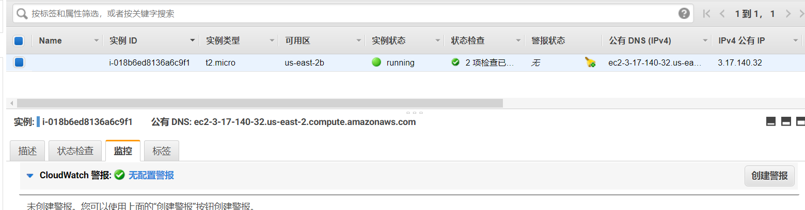

当指标数据达到您设定的水平时，您可以使用 CloudWatch 警报获取自动通知。

要编辑警报，首先请选择通知对象，然后设定何时发送通知。

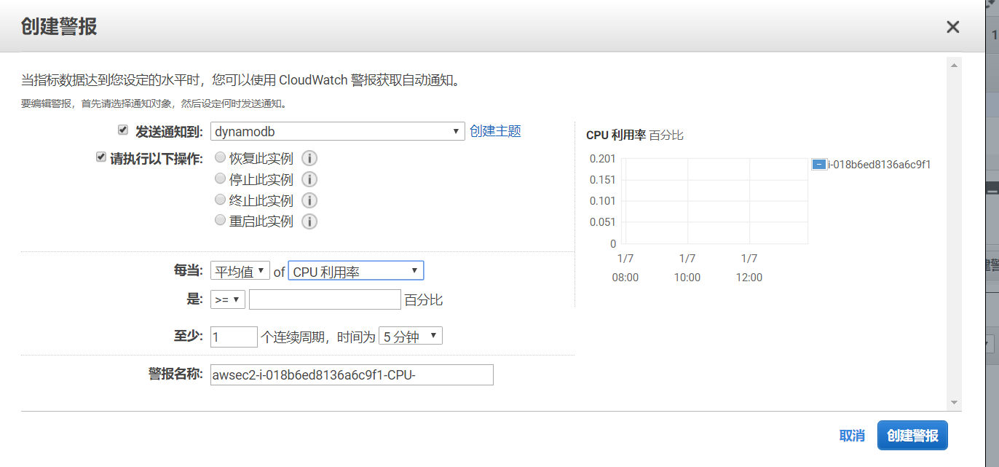

如果有多个SNS的主题，确保邮箱已经订阅这个主题。

> {"version":"0","id":"71a9f4e******77aaa2ec02d","detail-type":"EC2 Instance State-change Notification","source":"aws.ec2","account":"07295******16","time":"2020-01-07T14:01:36Z","region":"us-east-2","resources":["arn:aws:ec2:us-east-2:07295***16:instance/i-018b6*6c9f1"],"detail":{"instance-id":"i-018*9f1","state":"stopped"}}

Xshell连接AWS EC 

~~~
ssh -i /path/my-key-pair.pem ec2-user@ec2-198-51-100-1.compute-1.amazonaws.com
~~~

如果还提示，可以在本地先导入创建主机的私钥【**Amazon Linux 2 AMI (HVM), SSD Volume Type**】

EC2 开放端口是在网络安全--安全组--对应的组--入站

## Infrastructure as Code

 allows you to describe and provision all the infrastructure resources in your cloud environment. You can stand up servers, databases, runtime parameters, resources, etc. based on scripts that you write. Infrastructure as Code is a time-saving feature because it allows you to provision (or stand up) resources in a reproducible way.

有点类似docker 的 yml部署

## Cloud Formation（云模板）

使用模板创建额管理资源

AWS Cloud Formation allows you to model your entire infrastructure in a text file template allowing you to provision AWS resources based on the scripts you write.

- Cloud Formation is found under the Management & Governance section on the AWS Management Console.
- Cloud Formation templates are written using JSON or YAML.
- You can still individually manage AWS resources that are part of a Cloud Formation stack.

习题：

Since your infrastructure is now code, you can check your scripts into version control.

实习：

By the end of this lab, you will be able to:

- Create a CloudFormation stack using the CloudFormation Designer
- Launch S3 bucket using Infrastructure as Code
- Save and deploy a CloudFormation stack
- View resources created through CloudFormation

### Steps:

1. **Create CloudFormation Stack**
   - On the AWS Management Console page, type `cloud formation` in the `Find Services` box and then select `Cloud Formation`. ***Important:\*** The redesigned AWS CloudFormation console is available now. This tutorial covers the new designer. To access the new designer, click on the `Try it out now and provide us feedback.` message that displays in a message similar to what’s shown below.
   - On the AWS Management Console page, type `cloud formation` in the `Find Services` box and then select `Cloud Formation`.
   - If the left-hand menu options do not appear, expand the options by clicking on `` in the top left-hand corner.
   - Select `Designer` from the left-hand menu.
   - Locate `S3` in the `Resource Type` section and expand it.
   - Select Bucket and drag it to the designer window on the right-hand side.
   - Copy the JSON below and replace entirely the JSON found in the `Properties` (属性)tab.

~~~yaml
{
  "AWSTemplateFormatVersion": "2010-09-09",
  "Description": "Basic S3 Bucket CloudFormation template",
  "Resources": {
    "S3BucketCreatedByCloudFormation": {
      "Type": "AWS::S3::Bucket",
      "Properties": {
        "AccessControl": "PublicRead"
      }
    }
  },
  "Outputs": {
    "BucketName": {
      "Value": {
        "Ref": "S3BucketCreatedByCloudFormation"
      },
      "Description": "Name of the newly created Amazon S3 Bucket"
    }
  }
}
~~~

Hit the Refresh button in the upper right-hand corner so that the Designer is not out of date.

2. Save CloudFormation Stack

- In the CloudFormation Designer Toolbar, click the Document icon , and click Save.
- Click `Local File` and click `Save`. The JSON file will download.
- In the AWS CloudFormation Designer toolbar, click to validate your template（黑色对号）. You will see a message that states, `Template is valid`.

3. Deploy CloudFormation Stack

- In the CloudFormation Designer Toolbar, click to deploy the stack. （云朵图标）The `Create stack` screen appears.
- Accept the defaults and click `Next`.
- Enter a `Stack name`. Leave `Parameters` empty. Click `Next`.
- Leave the defaults and click `Next`.
- Review the stack details and click `Create Stack`. The stack status will be `CREATE_IN_PROGRESS`. To the current status of the stack, select the Refresh button in the upper right-hand corner. Once the stack reaches the `CREATE_COMPLETE` status, the stack has been deployed.

4. View S3 Bucket created by CloudFormation Stack

- From the `Services` menu option at the top, type in `S3` and select `S3`.
- To quickly find the bucket created by the CloudFormation Stack, click on `Date Created` in the column heading to sort by the most recent buckets created.
- The newly created bucket appears at the top, `cfs3stack-s3bucketcreatedbycloudformation-1at0fv1v9ndc1`.

5. Delete CloudFormation Stack

- To avoid on-going charges, delete the stack by navigating to the stack, and clicking the `Delete` button in the upper right-hand corner. ***Note:\*** When the stack is deleted, all resources created by the stack template will be deleted also.

## The AWS CLI 

(or Command Line Interface) allows you to access and control services running in your AWS account from the command line. To use the CLI, simply download, install, and configure it.

安装 本地CLI上使用;

~~~bash
 aws ec2 describe-instance	#list all of the instance running in account
 
 aws sns publish --topic-arn arn:aws:sns:us-east-1:xxxxxxx:topicName --message "Publish via Command LIne"	#publish a message to an SNS topic ,will returns the message ID and Email will received
 
 aws sqs(severice name) send-message(action) --queue-ur https://sqs.us-east-q.amazonaws.com/xxxx/payment-request-q.fifo --message-body "Message fROM CLI" --message-group-if "3424235577" --message-deduplication-id "456456222445"#send message to sqs
 
 aws sqs receive-message --queue-url https://sqs.us-east-q.amazonaws.com/xxxx/payment-request-q.fifo#list th message in a queue
 
aws s3 ls s3://codevr(bucket name) #list the contents of an S3 bucket via the CLI
~~~

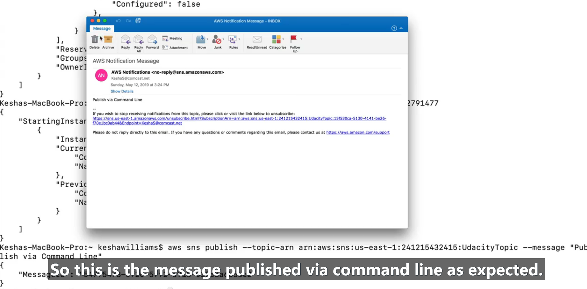


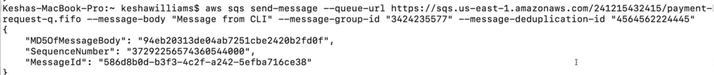


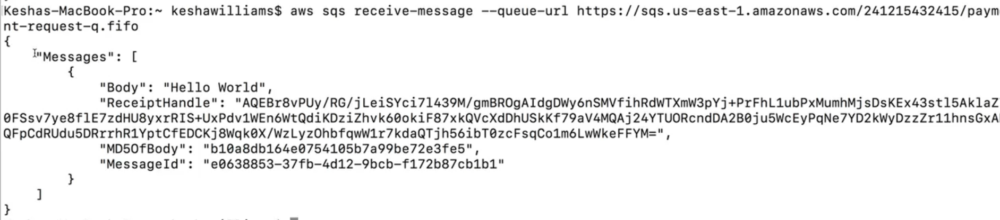

links [[AWS Command Line Interface](https://aws.amazon.com/cli/)](https://amazonaws-china.com/cn/cli/)

英文版 [https://amazonaws-china.com/cli/?nc1=h_ls](https://amazonaws-china.com/cli/?nc1=h_ls)

***

# lesson 19 - Cloud Formation

## Course Overview

**Lesson 1:** Introduction to Cloud Formation
**Lesson 2:** Understanding Diagrams of Cloud Architecture
**Lesson 3:** Infrastructure as Code (convert diagrams into code)
**Lesson 4:** Deploying Services
**Lesson 5:** Additional services that you’ll use in the project

## DevOps 

development operations

#### Issues that DevOps tries to solve:

- Unpredictable deployments
- Mismatched environments (development doesn’t match production) 不同的系统
- Configuration Drift-配置漂移，比如线上因为某次维护使得线上和本地开发不一致

#### DevOps gives best practices and tools for solving these problems:

- DevOps Tools: DevOps tools deploy and manage configuration changes to servers.
  - [Stackexchange](https://softwareengineering.stackexchange.com/questions/130850/difference-between-devops-and-software-configuration-management) has a discussion post detailing the difference between DevOps tools vs. Software Configuration Tools
- Allows for predictable deployments, because it’s an automated script.
- Enables **Continuous Integration Continuous Deployment (CI/CD)** so that new features are automatically deployed with all the required dependencies.

## CloudFormation

### AWS region used for this course

Choose AWS region US-west-2 (Oregon) for our course. This will guarantee the options are the same for all students.

### Glossary

**CloudFormation:** CloudFormation is a tool in AWS for managing, configuring and deploying infrastructure (push code along with the necessary server configurations).

习题：

You'll need these three tools to get started in CloudFormation：

* Version Control 
* Code Editor for YAML and JSON
* Amazon Web Services account

## Deciding Access Privileges within AWS

#### Programmatic Access

In the AWS console, choose "**programmatic access**." This allows us to use code to interact with AWS, instead of relying on mouse clicking in the console web pages.

#### Administrator Access

For IAM access, choose “**administrator access**.” This is just for initial setup of your account. Afterwards, you’ll want to limit access to only what you need.

#### Dev and Prod user accounts

In practice, Dev and DevOps members may have separate user accounts for the dev environment as opposed to the production environment. This makes it easier for developers by giving them wider privileges in the dev environment that would normally only be reserved for DevOps members in the production environment.

#### Access Key ID and Secret Access Keys

Remember not to save these in your code or to check into any repositories. Keep these private to you.

保证秘钥的安全性

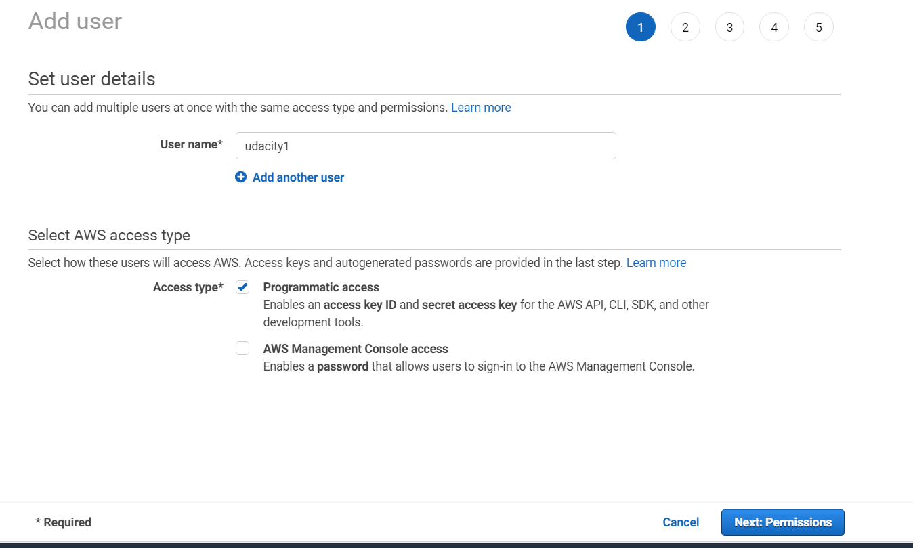


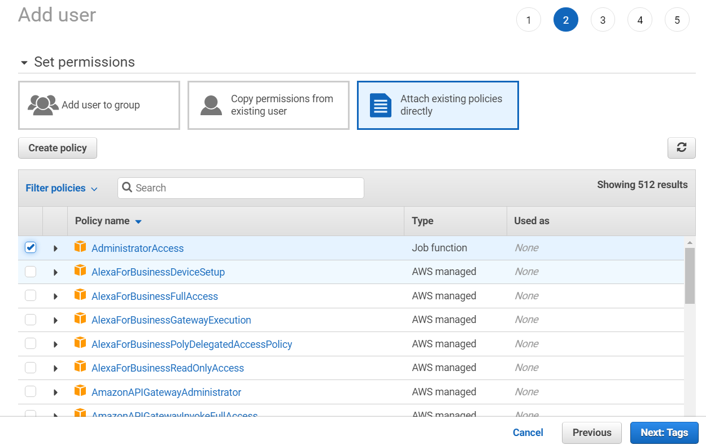

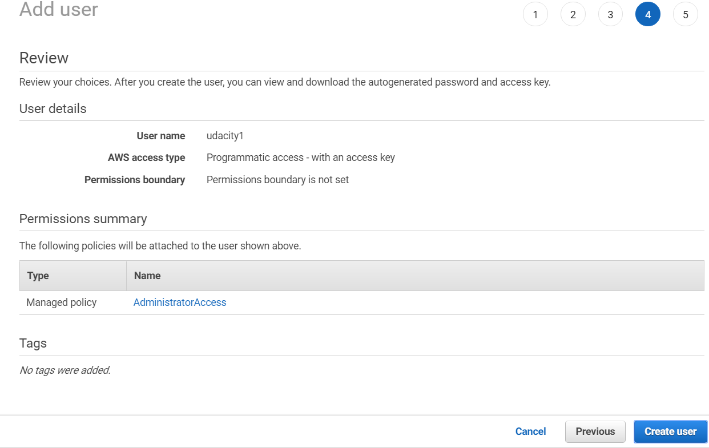

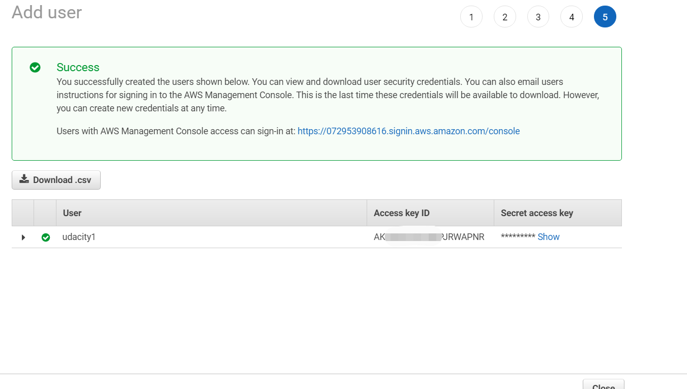

练习：

When creating a new API Access user, you will：

* Specify the region - in our case, us-west-2
* Create a programmatic access IAM User
* Configure the AWS CLI Tool with the newly created keys for our user
* Assign an appropriate IAM Policy to the user, depending on the required access

Specifying a region is a nice-to-have and not mandatory, but it does make your life easier when using region-specific services.

## Configuring AWS CLI

https://aws.amazon.com/cli/ to download software

习题：

Regarding your access keys it's always best to：

* Rotate them (change them ) frequently，It's great practice to change them every 90 days or sooner and 

* Make them inactive if they won't be used for a while，also to just delete them or mark them inactive when not in use.
* Please do NOT store your access key in a code repository; this is very insecure.
* We strongly recommend you don't put them in shared storage inside a text file either.

### Configuring the AWS Command Line Interface (CLI)

- Download and install the [AWS CLI tool.](https://aws.amazon.com/cli/)
- In the terminal, type `aws --version`: this verifies that you have the AWS CLI tool.

~~~
$ aws --version
aws-cli/1.17.3 Python/2.7.16 Windows/10 botocore/1.14.3

~~~


- To set up your AWS CLI, type `aws configure` in the terminal. Next when prompted for the AWS Access Key ID, paste in your `Secret access key`.
- Region: Please use `us-west-2`, even if you’re living closer to another available region.

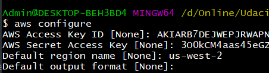

### Verifying your Setup

- One way to check if your AWS CLI is set up properly is to try a command. You can try listing your S3 buckets:`aws s3 ls` . **This will be blank if you have no S3 buckets**. However, if you have no error message, then you’ve verified that your user has API access to communicate with AWS.

~~~
aws s3 ls
2020-01-16 19:17:45 elasticbeanstalk-us-east-2-0729
~~~


- Note that each user can have up to 2 access keys at the same time.

more detail on 

1. [https://github.com/aws/aws-cli](https://github.com/aws/aws-cli)
2. [http://docs.aws.amazon.com/cli/latest/reference/](http://docs.aws.amazon.com/cli/latest/reference/)

## Additional Access Keys

Note that each user can have up to 2 access keys at the same time.

### Why Making Keys Inactive is a Better Choice

You may make your access key temporarily inactive rather than destroying it and creating a new one. This may be helpful if you want to stop an automated process that uses that key (for example, a CI/CD process).

## CloudFormation

- CloudFormation is a declarative language(声明性语言), not an imperative language（命令性语言）.
- CloudFormation handles resource dependencies, so that you don’t have to specify which resource to start up before another. There are cases where you can specify that a resource depends on another resource, but ideally, you’ll let CloudFormation take care of dependencies.
- VPC is the smallest unit of resource.

### Glossary

**Declarative languages**: These languages specify what you want, without requiring you to specify how to get it. An example of a popular declarative language is SQL.
**Imperative languages**: These languages use statements to change the state of the program.
*Additional resources:*

- Here is the [Wikipedia page](https://en.wikipedia.org/wiki/Imperative_programming) describing the differences between the two.
- Here is a [Stack Overflow](https://stackoverflow.com/questions/17826380/what-is-difference-between-functional-and-imperative-programming-languages) thread describing imperative languages.

## CloudFormation Script

#### YAML and JSON

- YAML and JSON file formats are both supported in CloudFormation, but YAML is the industry preferred version that’s used for AWS and other cloud providers (Azure, Google Cloud Platform).
- An important note about YAML files: the whitespace indentation matters! We recommend that you use **four white spaces for each indentation**.（四个空格作为一个缩进）

#### Glossary in CloudFormation scripts

**Name**: A name you want to give to the resource (does this have to be unique across all resource types?)
**Type**: Specifies the actual hardware resource that you’re deploying.
**Properties**: Specifies configuration options for your resource. Think of these as all the drop down menus and checkbox options that you would see in the AWS console if you were to request the resource manually.
**Stack**: A stack is a group of resources. These are the resources that you want to deploy, and that are specified in the YAML file.

#### Best practices

**Coding best practice:** Create separate files to organize your code. You can either create separate files for similar resources, or create files for each developer who uses those resources.

#### Documentation for CloudFormation syntax

You don't need to memorize the code that you need for each resource. You can find sample code in the [documentation for CloudFormation](https://docs.aws.amazon.com/index.html) for examples of how to write your CloudFormation scripts.

习题：

If you have a team of database, operations and networking experts, you would split your CloudFormation script into several files based on:

Type of resource

You'd have a file for network resources, another for database resources, and so on. This allows each expert to work on, and become familiar with, their resources and leverage their already-existing knowledge.

## run CloudFormation

- For this example, we’ll assume your CloudFormation file name is called `testcfn.yml`, and you’re giving your stack the name `myfirsttest`.
- In the terminal, to use your yml code to request the resources, type the following in the same directory as your yml file:

~~~yaml
aws cloudformation create-stack 
--stack-name myfirsttest 
--region us-west-2 
--template-body testcfn.yml
~~~

* You may also want to use `update-stack` when you want to update an existing stack instead of destroying your stack and creating a new one.

习题：

If you have a team of database, operations and networking experts, you would split your CloudFormation script into several files based on: Yes

CloudFormation uses a lot of logic behind the scenes to make sure everything works as expected, even when you don't specify resources in a specific order.

## Creating a VPC: Manually vs Automated

1. select our VPC from our region and I'll click the Create VPC button in the AWS console
2. use YAML file create at AWS CLI

## Automating with CloudFormation

duplicate with before we learn about create a user in IAM.

习题：

Can you verify the status of your CloudFormation stack from the command line?

Certainly! This is actually very useful if you are creating a program or script that verifies your stacks for you. However, if you are troubleshooting your stack, is probably best to do so from the AWS Console.


## Verifying in console

like in run CloudFormation ,use user use AWS cloud formation create-stack to create a stack in CLI

习题：

You are likely to need AWS Credentials (API Keys) in order to write code using the AWS SDK and to use the AWS Command Line Interface (CLI). Where do you suggest we store those credentials

On my work computer

Surprisingly, this is the best choice here! The problem with S3 and EC2 is that in order to access those, you'll need credentials in the first place.

## Conclusion

### Manually deploy an EC2 Instance for use with the CLI Tool.

We have installed and configured the AWS CLI to do our work for this course. However, there’s an alternative.

Go ahead and create an EC2 Instance that you can SSH into (or Remote Desktop, if you prefer Windows). Do this manually, in the console. Be sure to limit access to your IP address only, using Security Groups.

Once the instance is running, create an IAM Role with Admin access to your account, associate the role to your EC2 and install the AWS CLI on it.

The CLI tool, in this case, will pick up the credentials from the role and won’t need hard-coded credentials

# lesson 20 Infrastructure Diagrams 、基础设施图表

## Introduction

in the cloud,don't have physical access to that data center，need diagrams and then turn those diagrams into actual infrastructure called scripts

## Generalizing(归纳) to other cloud providers

similar names when it comes to other Cloud providers

In Google Cloud and AWS, they call it BPC

Generalizable to AWS, Google Cloud Platform, Microsoft Azure

The diagrams and resources covered in this lesson are generalizable to other cloud providers (such as Azure and Google Cloud Platform).

## Setting up Lucidcharts

练习：

Cloud Architecture diagrams are...

a great discussion tool to communicate to others what you intend to create

#### Lucidchart

We’ll use [Lucidchart](https://lucidchart.com/) to create cloud diagrams. Other applications that generate diagrams include Visio or Cloudcraft.

**Note to students**: You won’t need to know how to create diagrams for the project. The goal of this lesson is to get you familiar with cloud diagrams so that you can write cloud formation code based on interpreting the diagrams.

### Exercise: Setting Up Lucid Charts

1. **Open** your browser and go navigate to https://www.lucidchart.com/


[](https://classroom.udacity.com/nanodegrees/nd003-bert/parts/d9261840-748d-4d0e-a4db-fcc94d511fdd/modules/31350216-5d13-4b5a-8695-45b28a6a1c5a/lessons/cf58481e-ac1b-4c1a-8243-1e46b87243c0/concepts/ebfe4292-c64f-4158-8ad6-44ae983ea85b#)


1. **Click** the plus icon to create a new `Document`


[](https://classroom.udacity.com/nanodegrees/nd003-bert/parts/d9261840-748d-4d0e-a4db-fcc94d511fdd/modules/31350216-5d13-4b5a-8695-45b28a6a1c5a/lessons/cf58481e-ac1b-4c1a-8243-1e46b87243c0/concepts/ebfe4292-c64f-4158-8ad6-44ae983ea85b#)


1. **Click** on `Blank Diagram` to select a blank template.


[](https://classroom.udacity.com/nanodegrees/nd003-bert/parts/d9261840-748d-4d0e-a4db-fcc94d511fdd/modules/31350216-5d13-4b5a-8695-45b28a6a1c5a/lessons/cf58481e-ac1b-4c1a-8243-1e46b87243c0/concepts/ebfe4292-c64f-4158-8ad6-44ae983ea85b#)


- You should now have a blank Document that looks like this:


[](https://classroom.udacity.com/nanodegrees/nd003-bert/parts/d9261840-748d-4d0e-a4db-fcc94d511fdd/modules/31350216-5d13-4b5a-8695-45b28a6a1c5a/lessons/cf58481e-ac1b-4c1a-8243-1e46b87243c0/concepts/ebfe4292-c64f-4158-8ad6-44ae983ea85b#)


1. **Click** on the `Shapes` button in the top left of the control panel to access the `Shape Manager` screen


[](https://classroom.udacity.com/nanodegrees/nd003-bert/parts/d9261840-748d-4d0e-a4db-fcc94d511fdd/modules/31350216-5d13-4b5a-8695-45b28a6a1c5a/lessons/cf58481e-ac1b-4c1a-8243-1e46b87243c0/concepts/ebfe4292-c64f-4158-8ad6-44ae983ea85b#)


[](https://classroom.udacity.com/nanodegrees/nd003-bert/parts/d9261840-748d-4d0e-a4db-fcc94d511fdd/modules/31350216-5d13-4b5a-8695-45b28a6a1c5a/lessons/cf58481e-ac1b-4c1a-8243-1e46b87243c0/concepts/ebfe4292-c64f-4158-8ad6-44ae983ea85b#)


1. **Select** both `AWS Architecture 2017` & `AWS Architecture 2019` and then **Click** the `X` icon in the top right hand corner.


## 20-5 : Diagramming AWS Accounts and Regions

#### Cloud Container

This represents your AWS account and all resources it can access.

#### Region

A local business may be entirely contained in a region.

习题：

If my diagram covers multiple AWS accounts, regions and subnets，

Create multiple diagrams, with each diagram covering a logical container, such as subnet, VPC or Account.

If you have too much going on inside a subnet, for example, you could create a Cloud Architecture diagram just for that one subnet and have a separate diagram that shows the VPC, AWS Account and/or region.

Large diagrams become unreadable and difficult to print and present on the screen. It is best to have a "full scope" diagram that just shows accounts, regions or VPCs. Along with reduced-scope diagrams, it should show a specific subnet or VPC.

20-6 ：Diagramming AWS accounts & regions

1. From the `Shapes` panel. Scroll down to the `Containers` and drag `AWS cloud` container onto your canvas.


[](https://classroom.udacity.com/nanodegrees/nd003-bert/parts/d9261840-748d-4d0e-a4db-fcc94d511fdd/modules/31350216-5d13-4b5a-8695-45b28a6a1c5a/lessons/cf58481e-ac1b-4c1a-8243-1e46b87243c0/concepts/75fb551c-d726-4e75-9a5d-86d80269bbbd#)


[](https://classroom.udacity.com/nanodegrees/nd003-bert/parts/d9261840-748d-4d0e-a4db-fcc94d511fdd/modules/31350216-5d13-4b5a-8695-45b28a6a1c5a/lessons/cf58481e-ac1b-4c1a-8243-1e46b87243c0/concepts/75fb551c-d726-4e75-9a5d-86d80269bbbd#)


1. **Stretch** your `AWS cloud` container to give yourself more room by dragging its corners.


[](https://classroom.udacity.com/nanodegrees/nd003-bert/parts/d9261840-748d-4d0e-a4db-fcc94d511fdd/modules/31350216-5d13-4b5a-8695-45b28a6a1c5a/lessons/cf58481e-ac1b-4c1a-8243-1e46b87243c0/concepts/75fb551c-d726-4e75-9a5d-86d80269bbbd#)


1. **Search** for `users` and locate `AWS General Users`


[](https://classroom.udacity.com/nanodegrees/nd003-bert/parts/d9261840-748d-4d0e-a4db-fcc94d511fdd/modules/31350216-5d13-4b5a-8695-45b28a6a1c5a/lessons/cf58481e-ac1b-4c1a-8243-1e46b87243c0/concepts/75fb551c-d726-4e75-9a5d-86d80269bbbd#)


[](https://classroom.udacity.com/nanodegrees/nd003-bert/parts/d9261840-748d-4d0e-a4db-fcc94d511fdd/modules/31350216-5d13-4b5a-8695-45b28a6a1c5a/lessons/cf58481e-ac1b-4c1a-8243-1e46b87243c0/concepts/75fb551c-d726-4e75-9a5d-86d80269bbbd#)


1. **Drag** the `AWS General Users` onto your canvas.


[](https://classroom.udacity.com/nanodegrees/nd003-bert/parts/d9261840-748d-4d0e-a4db-fcc94d511fdd/modules/31350216-5d13-4b5a-8695-45b28a6a1c5a/lessons/cf58481e-ac1b-4c1a-8243-1e46b87243c0/concepts/75fb551c-d726-4e75-9a5d-86d80269bbbd#)


1. **Rename** your `AWS General Users` shape to `Users`.


## 20-7 ：Diagramming Availability Zones

* You can think of an availability zone as a data center
* AZs or availability zones are designed to be resilient by themselves，always want to have more than one
* design an application that is highly available，having more than one availability zone
* think about **cost** or **high availability**

#### Glossary

**Availability Zones (AZ):** An AZ is a data center (physical building).

### Best Practices

- Choose to have more than one availability zone to avoid a single point of failure.
- Include more than one availability zone to design for high availability, .
- You may choose to reduce to one AZ, possibly for prototyping（原型设计） and design for low cost. But it is not recommended for production environments.

### 20-8 ： Exercise: Diagramming Availability Zones

1. **Locate** the `Availability Zone` shape from the `Containers` section.


[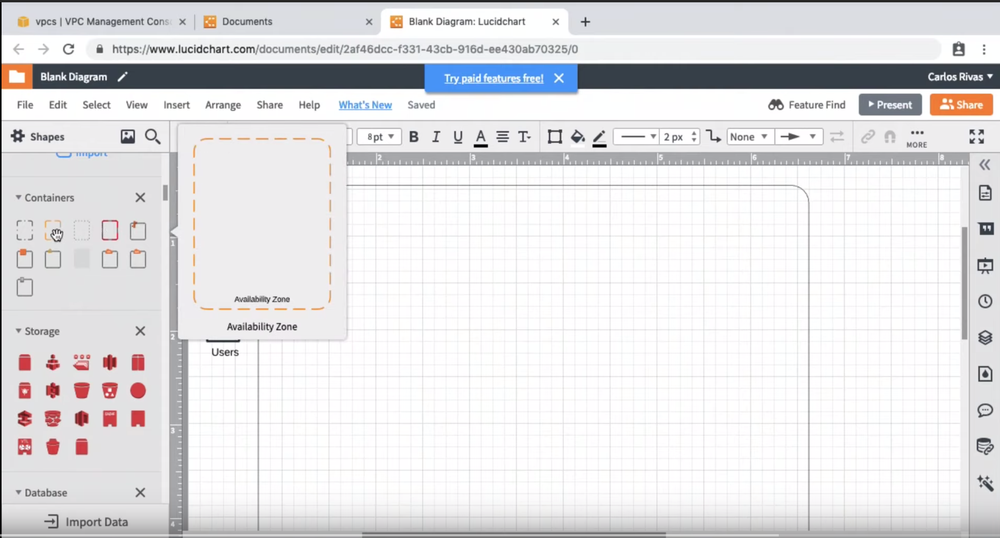](https://classroom.udacity.com/nanodegrees/nd003-bert/parts/d9261840-748d-4d0e-a4db-fcc94d511fdd/modules/31350216-5d13-4b5a-8695-45b28a6a1c5a/lessons/cf58481e-ac1b-4c1a-8243-1e46b87243c0/concepts/efb15a8e-b7b4-463d-a41e-15df81c83d83#)


1. **Drag** the `Availability Zone` shape inside of your existing `AWS cloud` container.


[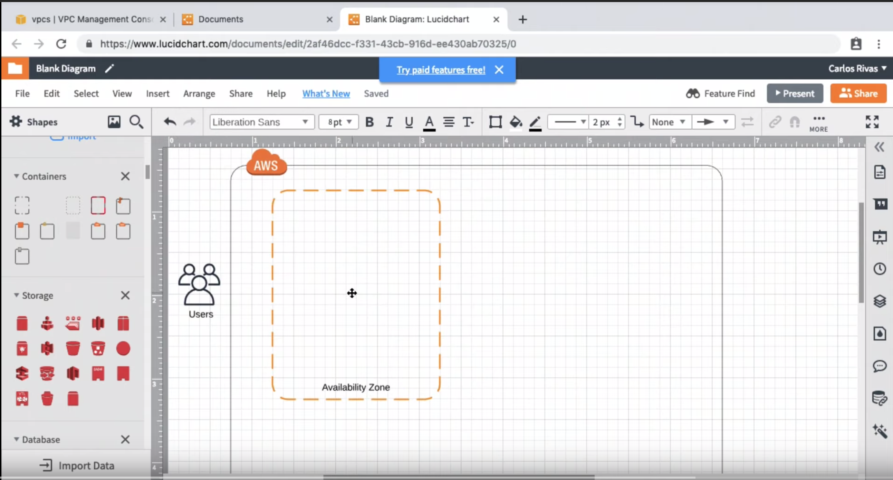](https://classroom.udacity.com/nanodegrees/nd003-bert/parts/d9261840-748d-4d0e-a4db-fcc94d511fdd/modules/31350216-5d13-4b5a-8695-45b28a6a1c5a/lessons/cf58481e-ac1b-4c1a-8243-1e46b87243c0/concepts/efb15a8e-b7b4-463d-a41e-15df81c83d83#)


1. **Expand** your `Availability Zone`'s width within the `AWS cloud` container.


[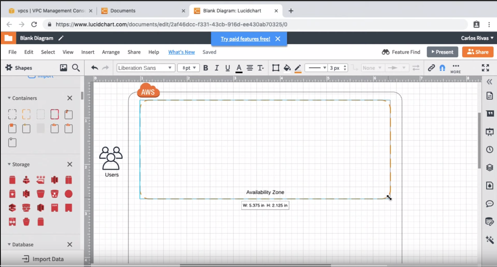](https://classroom.udacity.com/nanodegrees/nd003-bert/parts/d9261840-748d-4d0e-a4db-fcc94d511fdd/modules/31350216-5d13-4b5a-8695-45b28a6a1c5a/lessons/cf58481e-ac1b-4c1a-8243-1e46b87243c0/concepts/efb15a8e-b7b4-463d-a41e-15df81c83d83#)


1. **Add** another `Availability Zone` container below your existing `Availability Zone` container by repeating the initial 3 steps.


[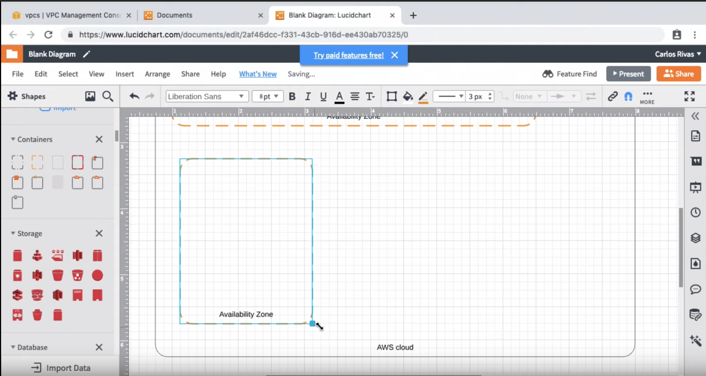](https://classroom.udacity.com/nanodegrees/nd003-bert/parts/d9261840-748d-4d0e-a4db-fcc94d511fdd/modules/31350216-5d13-4b5a-8695-45b28a6a1c5a/lessons/cf58481e-ac1b-4c1a-8243-1e46b87243c0/concepts/efb15a8e-b7b4-463d-a41e-15df81c83d83#)


- Your final result should look like this:


[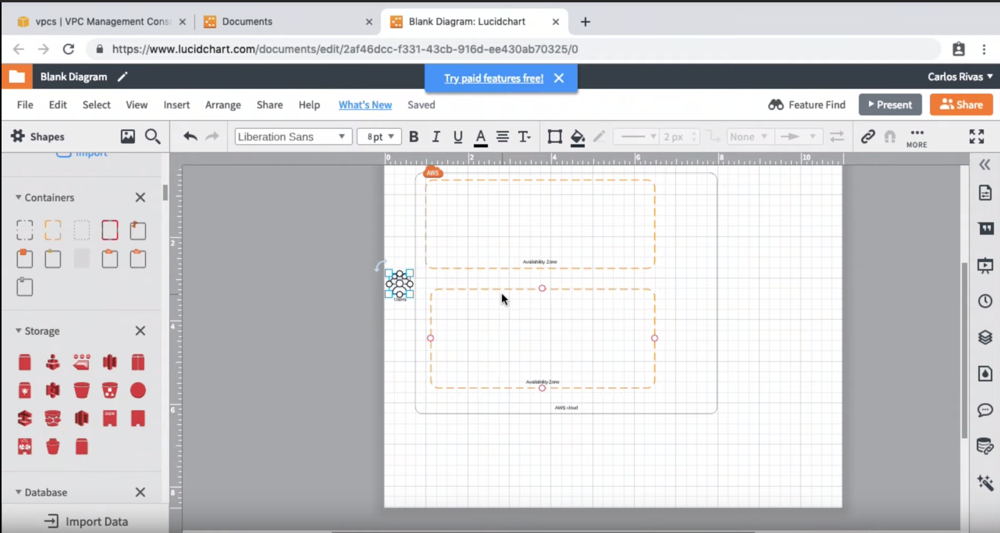](https://classroom.udacity.com/nanodegrees/nd003-bert/parts/d9261840-748d-4d0e-a4db-fcc94d511fdd/modules/31350216-5d13-4b5a-8695-45b28a6a1c5a/lessons/cf58481e-ac1b-4c1a-8243-1e46b87243c0/concepts/efb15a8e-b7b4-463d-a41e-15df81c83d83#)


## 20-9 ： Virtual Private Cloud

* the main goal of the VPC is to provide private IP address space for your network and resources.
* A subnet is simply a smaller chunk of that IP address space.
  1. The slash number at the end of an address represents the number of bits that are constant for this VPC or subnet from left to right.
* VPC has the ability to span over several availability zones in Diagramming.
* Divide the number behind the slash by 8, which is the fixed number at the front of the subnet

#### Glossary

**Virtual Private Cloud (VPC)**: A virtual private cloud is a pool of networked cloud resources. **It can span more than one availability zone**.
The equivalent of this would be a data center. However, thanks to availability zones, VPCs can span more than one physical building. This is an amazing feature that protects against real world disasters like electrical failures, fires and similar events.

### 20-10 : Exercise: Virtual Private Cloud

1. **Locate** the `Virtual Private Cloud` container from the `Shapes` panel.


[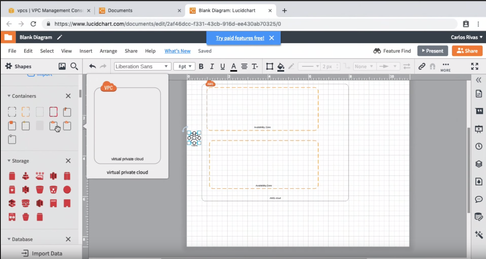](https://classroom.udacity.com/nanodegrees/nd003-bert/parts/d9261840-748d-4d0e-a4db-fcc94d511fdd/modules/31350216-5d13-4b5a-8695-45b28a6a1c5a/lessons/cf58481e-ac1b-4c1a-8243-1e46b87243c0/concepts/9cacac1f-06e0-4063-b5d7-f34357e06296#)


1. **Drag** the `Virtual Private Cloud` container onto your canvas.


[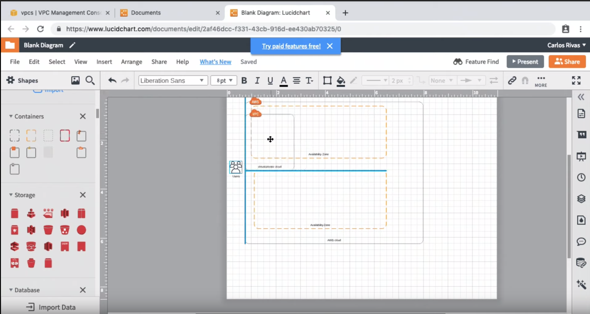](https://classroom.udacity.com/nanodegrees/nd003-bert/parts/d9261840-748d-4d0e-a4db-fcc94d511fdd/modules/31350216-5d13-4b5a-8695-45b28a6a1c5a/lessons/cf58481e-ac1b-4c1a-8243-1e46b87243c0/concepts/9cacac1f-06e0-4063-b5d7-f34357e06296#)


1. Arrange your `Virtual Private Cloud` container so that it encloses both of your `Availability Zones`.


[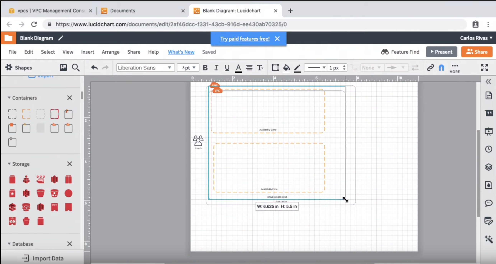](https://classroom.udacity.com/nanodegrees/nd003-bert/parts/d9261840-748d-4d0e-a4db-fcc94d511fdd/modules/31350216-5d13-4b5a-8695-45b28a6a1c5a/lessons/cf58481e-ac1b-4c1a-8243-1e46b87243c0/concepts/9cacac1f-06e0-4063-b5d7-f34357e06296#)


1. **Locate** the `VPC _subnet` container from the `Shapes` panel.


[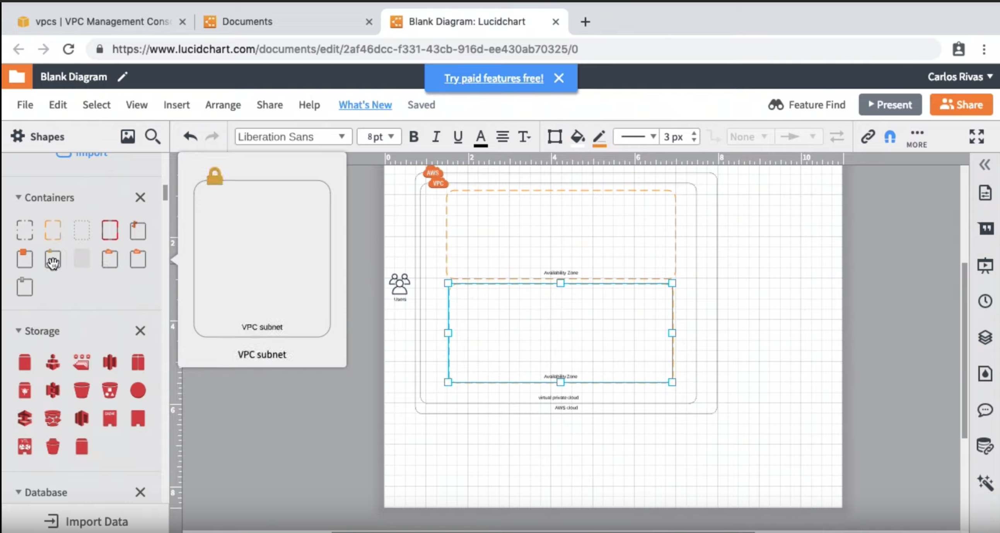](https://classroom.udacity.com/nanodegrees/nd003-bert/parts/d9261840-748d-4d0e-a4db-fcc94d511fdd/modules/31350216-5d13-4b5a-8695-45b28a6a1c5a/lessons/cf58481e-ac1b-4c1a-8243-1e46b87243c0/concepts/9cacac1f-06e0-4063-b5d7-f34357e06296#)


1. **Drag** the `VPC _subnet` container onto your canvas and place it inside of your first `Availability Zone`.


[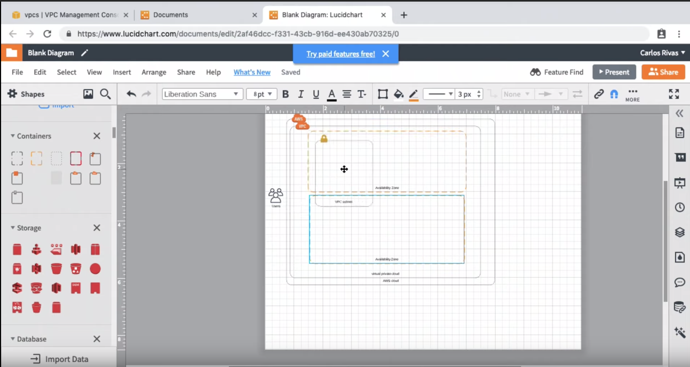](https://classroom.udacity.com/nanodegrees/nd003-bert/parts/d9261840-748d-4d0e-a4db-fcc94d511fdd/modules/31350216-5d13-4b5a-8695-45b28a6a1c5a/lessons/cf58481e-ac1b-4c1a-8243-1e46b87243c0/concepts/9cacac1f-06e0-4063-b5d7-f34357e06296#)


[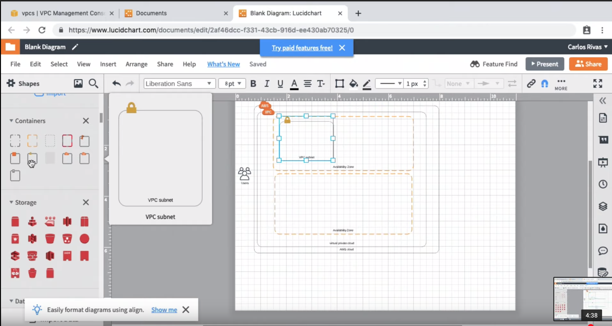](https://classroom.udacity.com/nanodegrees/nd003-bert/parts/d9261840-748d-4d0e-a4db-fcc94d511fdd/modules/31350216-5d13-4b5a-8695-45b28a6a1c5a/lessons/cf58481e-ac1b-4c1a-8243-1e46b87243c0/concepts/9cacac1f-06e0-4063-b5d7-f34357e06296#)


1. **Drag** another `VPC _subnet` container onto your canvas, but this time place it in your second `Availability Zone`.


[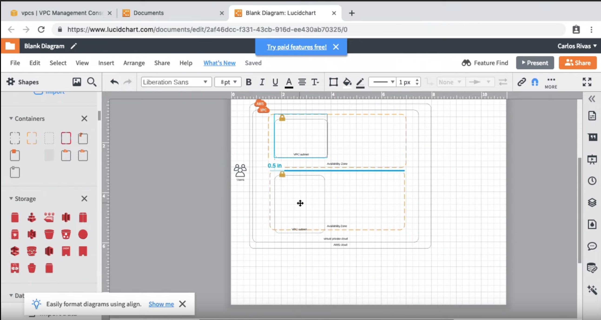](https://classroom.udacity.com/nanodegrees/nd003-bert/parts/d9261840-748d-4d0e-a4db-fcc94d511fdd/modules/31350216-5d13-4b5a-8695-45b28a6a1c5a/lessons/cf58481e-ac1b-4c1a-8243-1e46b87243c0/concepts/9cacac1f-06e0-4063-b5d7-f34357e06296#)


1. **Rename** the top`VPC _subnet` container to `Public Subnet 1` and the bottom `VPC_subnet` container to `Public Subnet`.


[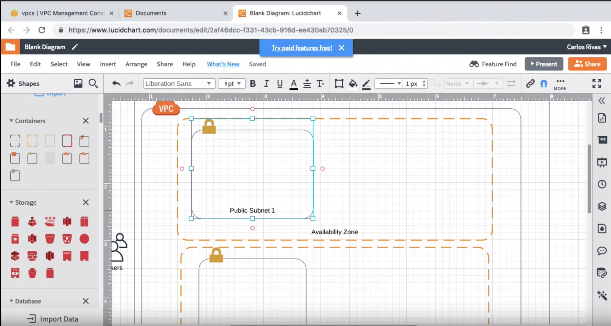](https://classroom.udacity.com/nanodegrees/nd003-bert/parts/d9261840-748d-4d0e-a4db-fcc94d511fdd/modules/31350216-5d13-4b5a-8695-45b28a6a1c5a/lessons/cf58481e-ac1b-4c1a-8243-1e46b87243c0/concepts/9cacac1f-06e0-4063-b5d7-f34357e06296#)


[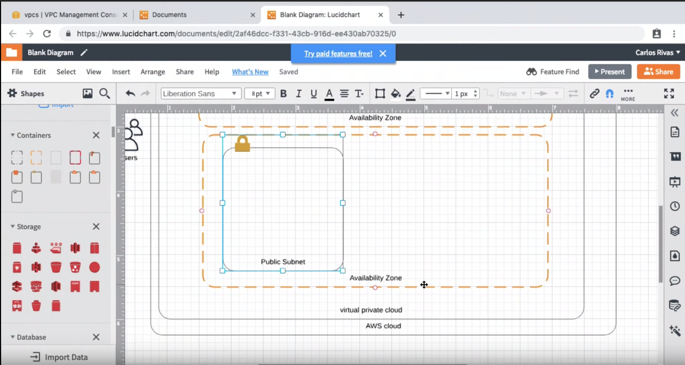](https://classroom.udacity.com/nanodegrees/nd003-bert/parts/d9261840-748d-4d0e-a4db-fcc94d511fdd/modules/31350216-5d13-4b5a-8695-45b28a6a1c5a/lessons/cf58481e-ac1b-4c1a-8243-1e46b87243c0/concepts/9cacac1f-06e0-4063-b5d7-f34357e06296#)

## 20-11 : Public vs Private Subnets

练习：

Public ：Public-facing Web Server / Load Balancer to your web servers

Private : Database / Back-end application server

#### Subnets

- A subnet is a subset of the overall VPC network and it only exists in a single availability zone, unlike its parent network, the VPC.
- A subnet contains resources, and can be assigned access rights that apply to all resources within that subnet.
- **Subnets can be public or private.** Public subnets are accessible to external users. Private subnets are only accessed internally by other resources within your cloud container.

#### Use IP addresses for routing traffic

- Use IP addresses as the “keys” for routing traffic. We can route traffic to stay within the VPC, or within a particular subnet, for security reasons.
- For example, a database or any sensitive data will be placed in a private subnet. A public server, like a web server, can be placed in a public subnet. Routing rules applied to a subnet allow us to define access to all resources placed inside that subnet.

### 20-12 : Exercise: Public vs Private Subnets

1. **Drag** 2 new `VPC_subnet` containers onto your canvas.


[](https://classroom.udacity.com/nanodegrees/nd003-bert/parts/d9261840-748d-4d0e-a4db-fcc94d511fdd/modules/31350216-5d13-4b5a-8695-45b28a6a1c5a/lessons/cf58481e-ac1b-4c1a-8243-1e46b87243c0/concepts/f42cfc44-bafa-462e-9642-4fed803f3cee#)


1. **Place** one of the newly dragged `VPC_subnet` containers into each of your `Availability Zone` containers.


[](https://classroom.udacity.com/nanodegrees/nd003-bert/parts/d9261840-748d-4d0e-a4db-fcc94d511fdd/modules/31350216-5d13-4b5a-8695-45b28a6a1c5a/lessons/cf58481e-ac1b-4c1a-8243-1e46b87243c0/concepts/f42cfc44-bafa-462e-9642-4fed803f3cee#)


1. **Rename** all of your `VPC_subnet` containers to match the following:


[](https://classroom.udacity.com/nanodegrees/nd003-bert/parts/d9261840-748d-4d0e-a4db-fcc94d511fdd/modules/31350216-5d13-4b5a-8695-45b28a6a1c5a/lessons/cf58481e-ac1b-4c1a-8243-1e46b87243c0/concepts/f42cfc44-bafa-462e-9642-4fed803f3cee#)

## 20-13 ： IGW Internet Gateway

习题

If I just created a VPC and I want to provide internet to it, I should make sure

* Create a route to the IGW and associate it with your subnet(s)
* Create an IGW
* Attach the IGW to  your VPC

Sometimes you'll forget the route or forget to attach the Internet Gateway. Just be sure to consider these steps when troubleshooting a "no internet access" issue.


#### Internet Gateway

- An internet gateway is a resource that enables inbound and outbound traffic from the internet to your VPC.
- An internet gateway allows external users access to communicate with parts of your VPC.
- If you create a private VPC for an application that is internal to your company, you will not need an internet gateway.

Network Address Translation (NAT) Gateway: provides **outbound-only** internet gateway for private services to access the internet. This keeps the private service protected from inbound connections, but allows it to connect to the internet *in order to perform functions such as downloading software updates.* The NAT gateway serves as an intermediary to take a private resource’s request, connect to the internet, and then relay the response back to the private resource without exposing(暴露) that private resource’s IP address to the public.

**Note**: Place NAT Gateways inside the **public** subnets and not the private subnets. NAT gateways need to be in the public subnet so that they can communicate with the public internet, and handle requests from resources that are in a private subnet.


### 20-14 ：Exercise: IGW Internet Gateway

1. **Search** for `VPC internet gateway` in the search shapes panel.


[](https://classroom.udacity.com/nanodegrees/nd003-bert/parts/d9261840-748d-4d0e-a4db-fcc94d511fdd/modules/31350216-5d13-4b5a-8695-45b28a6a1c5a/lessons/cf58481e-ac1b-4c1a-8243-1e46b87243c0/concepts/819bd9f7-b106-4e73-9b7c-7487368f6d94#)


[](https://classroom.udacity.com/nanodegrees/nd003-bert/parts/d9261840-748d-4d0e-a4db-fcc94d511fdd/modules/31350216-5d13-4b5a-8695-45b28a6a1c5a/lessons/cf58481e-ac1b-4c1a-8243-1e46b87243c0/concepts/819bd9f7-b106-4e73-9b7c-7487368f6d94#)


1. **Drag** the `VPC internet gateway` shape onto your canvas and place it directly to the right of your `Users`.


[](https://classroom.udacity.com/nanodegrees/nd003-bert/parts/d9261840-748d-4d0e-a4db-fcc94d511fdd/modules/31350216-5d13-4b5a-8695-45b28a6a1c5a/lessons/cf58481e-ac1b-4c1a-8243-1e46b87243c0/concepts/819bd9f7-b106-4e73-9b7c-7487368f6d94#)

## 20-15 ：Network Address Translation

* A NAT or Network Address Translation Service，is used to provide outbound Internet access to resources in your private sub-nets.
* What it does is it translates incoming public traffic into private traffic.
* it needs to have public access itself.

### 20-16 ： Exercise: NAT's

1. **Search** the shapes panel for `VPC_NAT gateway`.


[](https://classroom.udacity.com/nanodegrees/nd003-bert/parts/d9261840-748d-4d0e-a4db-fcc94d511fdd/modules/31350216-5d13-4b5a-8695-45b28a6a1c5a/lessons/cf58481e-ac1b-4c1a-8243-1e46b87243c0/concepts/5969f3f8-a425-47f6-b5e0-cd137ada357b#)


1. **Drag** the `VPC_NAT gateway` shape onto your canvas and place it directly inside `Public Subnet 1`.


[](https://classroom.udacity.com/nanodegrees/nd003-bert/parts/d9261840-748d-4d0e-a4db-fcc94d511fdd/modules/31350216-5d13-4b5a-8695-45b28a6a1c5a/lessons/cf58481e-ac1b-4c1a-8243-1e46b87243c0/concepts/5969f3f8-a425-47f6-b5e0-cd137ada357b#)


1. **Repeat** step 3, but instead place your new `VPC_NAT gateway` inside of `Public Subnet 2`.


[](https://classroom.udacity.com/nanodegrees/nd003-bert/parts/d9261840-748d-4d0e-a4db-fcc94d511fdd/modules/31350216-5d13-4b5a-8695-45b28a6a1c5a/lessons/cf58481e-ac1b-4c1a-8243-1e46b87243c0/concepts/5969f3f8-a425-47f6-b5e0-cd137ada357b#)


## 20-17 ：Autoscaling groups

* highly available/reliability(AZ1-->AZ2)
* elasticity (auto scaling,only pay for resources that you're actually using)

#### Glossary

**Autoscaling group:** An autoscaling group manages multiple instances of the same resource (for example, servers), based on need. For instance, when there is a lot of internet traffic to a site, the autoscaling group can start more servers. When there is less traffic, the autoscaling group can reduce the number of servers.

#### Best Practice

- It is recommended that an autoscaling group **spans more than one availability zone, for reliability**.
- If we set the autoscaling group to run one resource, it will run that one resource in one of the availability zones.
- If there is a failure of that resource, the autoscaling group will shut it down in that availability zone and start that same resource in the other availability zone.

### 20-18 : Exercise: Autoscaling Groups

1. **Search** the shapes panel for `EC2` compute service.


[](https://classroom.udacity.com/nanodegrees/nd003-bert/parts/d9261840-748d-4d0e-a4db-fcc94d511fdd/modules/31350216-5d13-4b5a-8695-45b28a6a1c5a/lessons/cf58481e-ac1b-4c1a-8243-1e46b87243c0/concepts/0772552f-52c9-4d57-8e48-ad64dfb9fea3#)


1. **Drag** the `EC2` computer service onto your canvas and place it directly inside `Public Subnet 1`, to the left of your `VPC_NAT gateway`.


[](https://classroom.udacity.com/nanodegrees/nd003-bert/parts/d9261840-748d-4d0e-a4db-fcc94d511fdd/modules/31350216-5d13-4b5a-8695-45b28a6a1c5a/lessons/cf58481e-ac1b-4c1a-8243-1e46b87243c0/concepts/0772552f-52c9-4d57-8e48-ad64dfb9fea3#)


1. **Rename** the `EC2` compute service to `WWW`.


[](https://classroom.udacity.com/nanodegrees/nd003-bert/parts/d9261840-748d-4d0e-a4db-fcc94d511fdd/modules/31350216-5d13-4b5a-8695-45b28a6a1c5a/lessons/cf58481e-ac1b-4c1a-8243-1e46b87243c0/concepts/0772552f-52c9-4d57-8e48-ad64dfb9fea3#)


1. **Duplicate** your `EC2` compute service and place it inside `Public Subnet 2`.


[](https://classroom.udacity.com/nanodegrees/nd003-bert/parts/d9261840-748d-4d0e-a4db-fcc94d511fdd/modules/31350216-5d13-4b5a-8695-45b28a6a1c5a/lessons/cf58481e-ac1b-4c1a-8243-1e46b87243c0/concepts/0772552f-52c9-4d57-8e48-ad64dfb9fea3#)


1. **Search** the shapes panel for `Auto Scaling` and locate the one under `Group Icons`.


[](https://classroom.udacity.com/nanodegrees/nd003-bert/parts/d9261840-748d-4d0e-a4db-fcc94d511fdd/modules/31350216-5d13-4b5a-8695-45b28a6a1c5a/lessons/cf58481e-ac1b-4c1a-8243-1e46b87243c0/concepts/0772552f-52c9-4d57-8e48-ad64dfb9fea3#)


1. **Drag** the `Auto Scaling` group icon onto your canvas and place it inside `Private Subnet 1`.


[](https://classroom.udacity.com/nanodegrees/nd003-bert/parts/d9261840-748d-4d0e-a4db-fcc94d511fdd/modules/31350216-5d13-4b5a-8695-45b28a6a1c5a/lessons/cf58481e-ac1b-4c1a-8243-1e46b87243c0/concepts/0772552f-52c9-4d57-8e48-ad64dfb9fea3#)


1. **Resize** the `Auto Scaling` group icon so that it starts in `Private Subnet 1`, then extends and covers `Private Subnet 2`.


## 20-19： Load Balancers

1. elastic load balancer distributes to exist server or instance
2. Auto scaling group increase server or instanse.
3. load balancer send requests to your servers,it's going to equally distribute the load of incoming requests
4. The load balancer will check health of servers,make sure that they're operational

#### Load Balancer

- A load balancer takes incoming traffic and distributes it to two or more resources. For example, it can take inbound user requests to access your website, and it can distribute the requests evenly among two or more servers.
- Without a load balancer, having public-facing servers in more than one AZ would mean that users would have to use a different URL to reach each of the AZs. This can be impractical(不切实际的) compared to just a single URL.

### 20-20: Exercise: Load Balancers

**Important:** Before this section we have taken the liberty of adding an `Amazon EC2 Instance` directly inside of `Public Subnet 1` & our `AutoScaling`. Please take the time to add this to your diagram before continuing with this exercise.

1. **Search** shapes panel for `Compute` section and find the `Auto Scaling Load Balancer` .


[](https://classroom.udacity.com/nanodegrees/nd003-bert/parts/d9261840-748d-4d0e-a4db-fcc94d511fdd/modules/31350216-5d13-4b5a-8695-45b28a6a1c5a/lessons/cf58481e-ac1b-4c1a-8243-1e46b87243c0/concepts/aba0cf6a-6c42-4a0c-84d8-745ec12c7fd9#)


1. **Drag** the `Application Load Balancer` onto your canvas and place it on the right side of your `Internet Gateway`.


[](https://classroom.udacity.com/nanodegrees/nd003-bert/parts/d9261840-748d-4d0e-a4db-fcc94d511fdd/modules/31350216-5d13-4b5a-8695-45b28a6a1c5a/lessons/cf58481e-ac1b-4c1a-8243-1e46b87243c0/concepts/aba0cf6a-6c42-4a0c-84d8-745ec12c7fd9#)

## 20-21: Security Groups

* security group，a way to manage traffic
* to provide network traffic control at the level of the server
* providing a web server and this web server opened on port 80

#### Security Groups

- Security groups manage traffic at the server level (the resource level). Security Groups aren’t for managing higher level groups such as subnets, VPC, or user accounts.
- The same security group can be assigned to multiple resources that require the same security access settings defined by that security group.

练习：

While you could certainly specify just one type of traffic, it's common practice to include rules for both inbound and outbound in a single Security group.

A security group can be scoped to a single IP address

you can be as specific as 1 IP address ( when giving access to yourself, for example ) or as broad as the entire network ( 0.0.0.0/0)

### 20-22: Exercise: Security Groups

1. **Search** the shapes panel in the `Containers` section and locate the `Security Group` container .


[](https://classroom.udacity.com/nanodegrees/nd003-bert/parts/d9261840-748d-4d0e-a4db-fcc94d511fdd/modules/31350216-5d13-4b5a-8695-45b28a6a1c5a/lessons/cf58481e-ac1b-4c1a-8243-1e46b87243c0/concepts/9dbbed0e-6153-4f2c-9e0b-33ecc9ae8523#)


1. **Drag** the `Security Group` container and place it on top of `Public Subnet 2`.


[](https://classroom.udacity.com/nanodegrees/nd003-bert/parts/d9261840-748d-4d0e-a4db-fcc94d511fdd/modules/31350216-5d13-4b5a-8695-45b28a6a1c5a/lessons/cf58481e-ac1b-4c1a-8243-1e46b87243c0/concepts/9dbbed0e-6153-4f2c-9e0b-33ecc9ae8523#)


1. **Resize** the `Security Group` container so that it is only surrounding our `EC2 Instance` .


[](https://classroom.udacity.com/nanodegrees/nd003-bert/parts/d9261840-748d-4d0e-a4db-fcc94d511fdd/modules/31350216-5d13-4b5a-8695-45b28a6a1c5a/lessons/cf58481e-ac1b-4c1a-8243-1e46b87243c0/concepts/9dbbed0e-6153-4f2c-9e0b-33ecc9ae8523#)

## 20-22: Routing Table

1. route tables can regulate traffic to and from your network

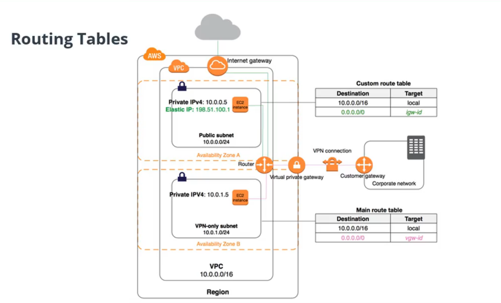

### 20-24 : Exercise: Routing Table

1. **Search** the shapes panel for `Route Table`.


[](https://classroom.udacity.com/nanodegrees/nd003-bert/parts/d9261840-748d-4d0e-a4db-fcc94d511fdd/modules/31350216-5d13-4b5a-8695-45b28a6a1c5a/lessons/cf58481e-ac1b-4c1a-8243-1e46b87243c0/concepts/f62d2b56-b823-431e-bff3-909ccb6e094d#)


1. **Drag** the `Route Table` and place it in the center of your 4 `Subnets`.


[](https://classroom.udacity.com/nanodegrees/nd003-bert/parts/d9261840-748d-4d0e-a4db-fcc94d511fdd/modules/31350216-5d13-4b5a-8695-45b28a6a1c5a/lessons/cf58481e-ac1b-4c1a-8243-1e46b87243c0/concepts/f62d2b56-b823-431e-bff3-909ccb6e094d#)

## 20-25 S3

1. if you need to access this bucket within your private subnets,you have to have those NAT gateways so that they can access the Internet

#### S3

- An S3 bucket is a public service for users to upload or download files.
- Place the S3 service **outside of your VPC**.

练习

Images, Video, large text files, log files, audit logs are all great uses for S3.

### 20-26 ： Exercise: S3

1. **Search** the shapes panel for `S3 Bucket`.


[](https://classroom.udacity.com/nanodegrees/nd003-bert/parts/d9261840-748d-4d0e-a4db-fcc94d511fdd/modules/31350216-5d13-4b5a-8695-45b28a6a1c5a/lessons/cf58481e-ac1b-4c1a-8243-1e46b87243c0/concepts/cd21e1d4-6e99-4625-be1b-2800a59233d1#)


1. **Drag** the `S3 Bucket` and place it on the outer exterior of your `AWS Cloud Container`.


[](https://classroom.udacity.com/nanodegrees/nd003-bert/parts/d9261840-748d-4d0e-a4db-fcc94d511fdd/modules/31350216-5d13-4b5a-8695-45b28a6a1c5a/lessons/cf58481e-ac1b-4c1a-8243-1e46b87243c0/concepts/cd21e1d4-6e99-4625-be1b-2800a59233d1#)

## 20-27 Reviewing Our Diagram

练习

1. Should I include hostnames and IP addresses in my cloud diagrams? No

Hostnames and IPs are bound to change, thus making your diagrams obsolete fairly quickly! Instead, use descriptive names such as "App Database", "BackEnd Server", or anything that has meaning to your audience.

 it would be too much clutter and the data can change.

## 20-28: Conclusion

1. ### Review the AWS Reference Architecture Page

   The goal here is to get you used to these type of diagrams which you will be required to create and review while performing work as a Cloud DevOps Engineer.

2. ### Create a diagram to represent a corporate-only cloud

   There is one more real-world scenario that is very popular, but not covered in this course. And that is the “extension of the on-premises network”.

   In this case, you’d have a network that only contains private subnets, and does not have NAT Gateways.

   These components get replaced by a VGW (Virtual Gateway) and a VPN Connection. You’ll also need a CGW (Customer Gateway), which represents the on-premises side of the VPN Connection.

----

# Lesson 21 - Networking Infrastructure 

## 21-2: Workflow and Helpers

* a normal CloudFormation script needs to have at least one resource
* Description totally optional

When creating your `.yml` file remember that using the `Description Field` is optional. Here we start by adding a short description of our name and project we are working on.

> ```yaml
> Description: >
>     Carlos Rivas / Udacity 2019
> ```

#### YAML File Available to You as a Resource

The `network.yml` file that I use here is included in the Resources tab in the left sidebar of this page, if you'd like to download it.


#### Recommended best practices

Although descriptions are optional , `Resource` fields are required. Remember to include **at least one resource** (e.g., a VPC, an EC2 instance, a database) in the CloudFormation `.yml` script, otherwise it will give an error when you try to run the script..

```yaml
Resources:
    VPC:
        TYPE: AWS::EC2::VPC
```


#### Practice Fixing Errors

- Practice fixing errors, as this will help you prepare for real scenarios on the job.

- For instance, try altering correct, working yml scripts to see if they generate an error.

- Practice reading error messages to understand what caused the error, and how to fix them.

  

  

#### Common commands used

Common commands we’ll use are 

`aws cloudformation create-stack`, 

and 

`aws cloudformation update-stack`.

## 21-3: VPC and Internet Gateway

* network.yml

* network-parameters.json ,the parameter file should be in `.json` format, as `.yml` format is not yet supported for the parameter file.

* you're going to take this Internet gateway and associate it with the VPC that you want,Otherwise it will just be an Internet gateway that is not connected to any network

* InternetGateway and InternetGatewayAttachment need add in yml

* Tags use !Ref to reference

  ~~~yaml
  Tags:
  	-Key : name
  	 Value : !Ref EnviromentName
  ~~~

  

  

#### Connecting VPC's & Internet Gateways

It's important to note when connecting an `Internet Gateway` to a `VPC`, we need to define an additional resource called `InternetGatewayAttachment`. This attachment references both the VPC and the InternetGateway. Here is the syntax for the following connection:

```
Type: AWS::EC2::VPCGatewayAttachment
Properties: 
  InternetGatewayId: String
  VpcId: String
  VpnGatewayId: String
```


### Don't hard-code parameters

Avoid hard coding parameter values. Instead, use a separate parameter file to store parameter values. Note that the parameter file should be in `.json` format, as `.yml` format is not yet supported for the parameter file.

Here is an example parameters file from `network-parameters.json` which is holding key-value pairs for the `Environment` & `VpcCIDR`.

```yaml
[
    {
        "ParameterKey": "EnvironmentName",
        "ParameterValue": "UdacityProject"
    },
    {
        "ParameterKey": "VpcCIDR",
        "ParameterValue": "10.0.0.0/16"
    }
]
```

#### Setting Parameters

**`Parameters` should be declared above your `Resources`:**

```
Parameters:
# whatever you consider a changing value, put it as a parameter instead of hard-coding it into your script
Resources:
```

and should follow the general format of:

```
Parameters:
  ParameterLogicalID:
    Type: DataType
    ParameterProperty: value
```

Here we set the `EnvironmentName` parameter in our sample code from the video:

```
Parameters:
    EnvironmentName:
        Description: An Environment name that will be prefixed to resources
        Type: String
```


#### Default Parameters


You can also provide default values for parameters in case one was not passed in. In this example you can see that `VpcCIDR` has a default value of `10.0.0.0/16`.

```
Parameters:
    EnvironmentName:
        Description: An Environment name that will be prefixed to resources
        Type: String

    VpcCIDR:
        Description: Please enter the IP range (CIDR notation) for this
        Type: String
        Default: 10.0.0.0/16
```


#### Calling CloudFormation


When calling AWS CloudFormation, you’ll pass in the name of the `.yml` file as well as the name of the parameter file as parameters to the CloudFormation call.

For example:

```
aws cloudformation create-stack --stack-name MyStack --template-body file://MyCloudformationScript.yml  --parameters file://MyEnvironmentVariables.json 
```

- Note that CloudFormation knows to create the resources in order, based on their dependencies (VPC and InternetGateway, before creating the InternetGatewayAttachment).


#### Further Resources


- The `network.yml` file that I use in this lesson is included in the Resources tab in the left sidebar of this page, if you'd like to download it.
- [Parameters](https://docs.aws.amazon.com/AWSCloudFormation/latest/UserGuide/parameters-section-structure.html)
- [VPC](https://docs.aws.amazon.com/AWSCloudFormation/latest/UserGuide/aws-resource-ec2-vpc.html)
- [VPCCidrBlock](https://docs.aws.amazon.com/AWSCloudFormation/latest/UserGuide/aws-resource-ec2-vpccidrblock.html)
- [Internet Gateway](https://docs.aws.amazon.com/AWSCloudFormation/latest/UserGuide/aws-resource-ec2-internetgateway.html)

