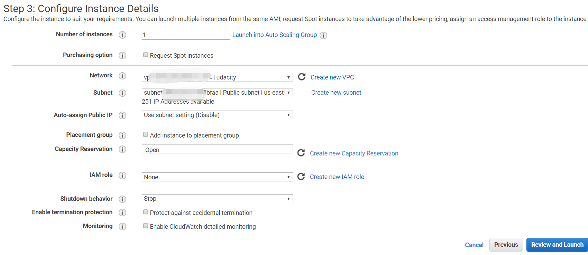
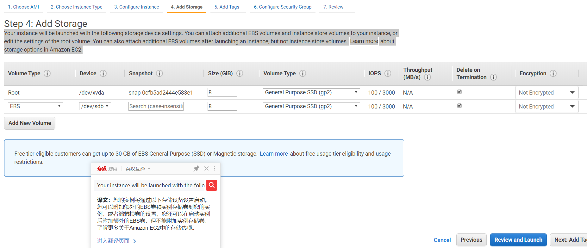
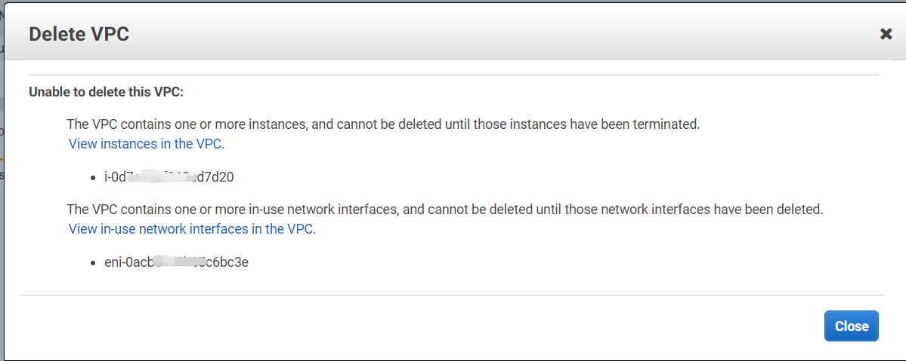
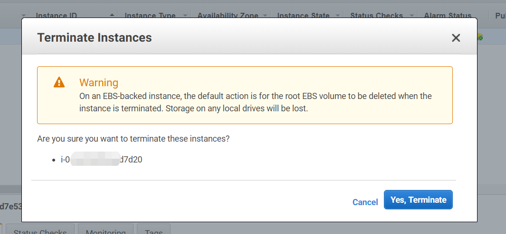
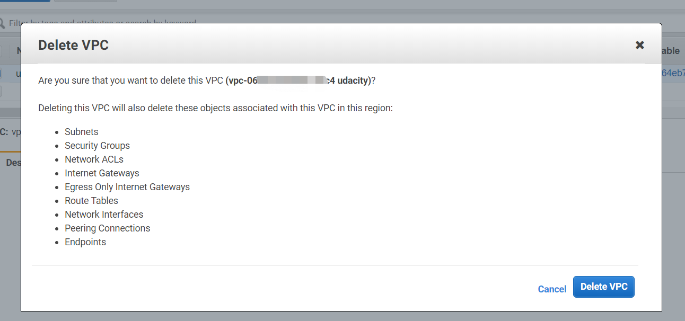

# Udacity-Bertelsmann-Scholarship-2019_Cloud-Track

Bertelsmann Tech Scholarship Challenge Course - Cloud Track on Udacity.com

## Chapter Cloud Fundamental 

****

## 云计算 Cloud Computing

包含：

* Database 数据库
* Computer Power 计算力
* Application 应用
* Security 安全

特点：

1. Pay-as-you-go 即用即付 无长期合同
2. Auto scaling 自动伸缩 自动增减
3. Sever-less 无主机 cloud运营商提供管理主机服务（cloud provider manages servers for you）；分工

## 云计算类型 Types of Cloud Computing

1. ### Infrastructure-as-a-Service (IaaS) 基础架构服务

   The provider supplies virtual server instances, storage, and mechanisms for you to manage servers.

   虚拟机，存储，机器（AWS/阿里云/Linode/Digital Ocean）

2. ### Platform-as-a-Service (PaaS)

   A platform of development tools hosted on a provider's infrastructure.

   开发工具在他们的基础架构上，服务商管理硬件和系统，使用者只关注管理和开发应用（Godady/ salesforce）

3. ### Software-as-a-Service (SaaS)

   A software application that runs over the Internet and is managed by the service provider.

   提供某种软件来使用（Gmail / Office 365）

Did you know that Amazon Web Services (AWS) provides a mix of infrastructure as a service (IaaS), platform as a service (PaaS) and packaged software as a service (SaaS) offerings?

## 云部署模型  Cloud Deployment Models

1. 公有云 Public Cloud

   A public cloud makes resources available over the Internet to the general public.

   资源包括 服务器、数据库、应用开发服务

   AWS是最大公有云提供商

2. 私有云 Private Cloud 

   A private cloud is a proprietary(专属) network that supplies services to a limited number of people.

   On-premises 内部部署  best describes a private cloud.

3. 混合云 Hybrid Cloud

   A hybrid model contains a combination of both a public and a private cloud.

   *he hybrid model gives organizations the flexibility to slowly migrate to the cloud.*

   PII(personally identifiable information) 和网页服务搭配使用时

## 可见好处 Common Benefits

- ability to innovate quickly

- ability to fail fast

  fail-fast就是在做系统设计的时候先考虑异常情况，一旦发生异常，直接停止并上报

  对两个整数做除法的方法，在divide方法中，我们对被除数做了个简单的检查，如果其值为0，那么就直接抛出一个异常，并明确提示异常原因。这其实就是fail-fast理念的实际应用。
  这样做的好处就是可以预先识别出一些错误情况，一方面可以避免执行复杂的其他代码，另外一方面，这种异常情况被识别之后也可以针对性的做一些单独处理。

- Stop guessing about capacity.

- Avoid huge capital investments(投资) up front.

- Pay for only what you use.

- Scale globally in minutes.

- Deliver faster.

## Cloud 服务商

* AWS - Amazon Web Services
* GCP- Google Cloud Platform 
* Microsoft Azure 

## AWS 服务预览

1. Analytics 分析

   Amazon Quicksight

2. Application integration 应用集成

   SQS- simple queue service

   SNS- simple notification service

3. AWS cost management / Budgets (预算)

4. Compute services

   * EC2 -Elastic(弹性) Cloud Compute 虚拟机
   * Lambda 拉姆达 无主机服务
   * Elastic Beanstalk 网页服务

5. 数据库 Database

   * MySQL
   * Oracle
   * SQL Server
   * NoSQL - Dynamo DB
   * Document-based Database -MongoDB

6. Developer Tools

   * AWS Cloud 9 -Cloud IDE
   * Code Pipeline -continue integration 持续集成

7. Security services 安全服务

   * KMS -  key management service for data encryption
   * AWS shield - DDoS protection
   * IAM -Identity and Access Management 

8. Additional Services

   - Blockchain
   - Machine Learning
   - Computer Vision
   - Internet of Things (IoT)
   - AR/VR

将会学习到：

popular storage、content delivery services 、networking 、security and messaging services

## 全球基础架构 Global Infrastructure

1. ### Region 区域 （22） 

   A region is considered a geographic location or an area on a map.

   区域间资源不会跨区域复制replicate

2. ### Availability Zone AZs 可用区

   An availability zone is an isolated location within a geographic region and is a physical data center within a specific region.一个可用区失败不会影响到另外一个可用区

3. ### Edge Location 本地区域

   An edge location is as a mini-data center used solely to cache large data files closer to a user's location. CDN

### Additional Information

- There are more Availability Zones (AZs) than there are Regions.
- There should be at least two AZs per Region.
- Each region is located in a separate geographic area.
- AZs are distinct locations that are engineered to be isolated from failures.

## 共同责任模式 Shared Responsibility Model

当我们开发程序并提供服务给用户和客户时，我们与AWS共同承担责任

### AWS is responsible for:

- Securing edge locations
- Monitoring physical device security
- Providing physical access control to hardware/software
- Database patching
- Discarding physical storage devices
- Providing generators and un-interruptible power supply (UPS) systems

### You are responsible for:

* Managing AWS Identity and Access Management (IAM)
* Encrypting data
* Preventing or detecting when an AWS account has been compromised
* Restricting access to AWS services to only those users who need it
* Applying security patches to EC2 
* Configuring a firewall

## 开设试用账户 Setup free-tier account

## Prerequisites:

- Credit card
- Valid email address
- Phone number (used during sign up for validation)
- Virtual Multi-Factor Authentication (MFA) application, such as, Google Authenticator, Authy 2-Factor Authentication, or Authenticator installed on your mobile phone

# Travel blog website

## 为何需要云服务器

1. Scale capacity up and down based on demands.
2. Storage, more memory, and computing power can be added as needed.
3. Obtain servers in minutes.
4. No need for onsite hardware or capital expenses.

## EC2 - Elastic Cloud Compute 云中的虚拟服务器，弹性云计算

EC2 instance 

EC2 is found under the Compute section of the AWS Management Console.是AWS 最小的基础单位

价格选项：

1. On Demand - Pay as you go, no contract.
2. Dedicated Hosts - You have your own dedicated hardware and don't share it with others.
3. Spot(点) - You place a bid on an instance price. If there is extra capacity that falls below your bid, an EC2 instance is provisioned. If the price goes above your bid while the instance is running, the instance is terminated.
4. Reserved Instances - You earn huge discounts if you pay up front and sign a 1-year or 3-year contract.

## EBS -elastic block store 弹性块存储

a storage solution for EC2 instances and is a physical hard drive that is attached to the EC2 instance to increase storage.

好处 benefit ：

1. able to persist(存留) data after EC2 is terminated
2. automatically  replicated in its AZ(availability zone)

## security in the cloud

- Configure your virtual network with public or private facing subnets-使用面向公共或私有子网配置虚拟网络
- Launch your servers in the selected network to secure access-启动所选网络中的服务器以确保访问安全

## Virtual Private Cloud (VPC)-隔离云资源

Virtual Private Cloud or VPC allows you to create your own private network in the cloud. You can launch services, like EC2, inside of that private network. A VPC spans all the Availability Zones in the region.

VPC 可以控制：

- IP address ranges
- subnets
- route tables
- network gateways

EC2 Instances can be launched in a VPC, and you can store data in Amazon S3 and restrict access so that it’s only accessible from instances in your VPC.

## AWS实战项目

Topics Covered:

By the end of this lab, you will be able to:

- Launch a secure EC2 (Elastic Cloud Compute) instance within a VPC (Virtual Private Cloud)
- Manage an EBS volume


### **Access VPC service from AWS Management Console**

- On the AWS Management Console page, type `vpc` in the `Find Services` box and then select `VPC`.
- Click the `Launch VPC Wizard` button and select `VPC with a Single Public Subnet`. ***Important:\*** In the `VPC Name` text box, enter a name for the VPC, and then select the first AZ from the `Availability Zone` dropdown. Leave everything else as the defaults.
- Select `Create VPC` button.
- You should see the `VPC Successfully Created` page, click the OK button in the far right. ***Important:\*** You should see a table that lists all of the VPCs, make a note of the one just created.

### **Launch an EC2 instance**

- Navigate to the EC2 console page, by clicking on `Services` in the upper left-hand menu. Type `EC2` in the text box and click on `EC2` found in the search results.
- On the EC2 Dashboard page, click on `Instances` in the left-hand navigation.
- Click `Launch Instance`.
- Select the `Amazon Linux 2 AMI (HVM), SSD Volume Type` Amazon Machine Image (AMI). ***Important:\*** You are free to choose a different AMI, but to avoid excessive charges, pick one that says, `Free Tier Eligible`.
- For the `Instance Type`, select the free-tier instance type of `t2.micro`.
- Click on `Next: Configure Instance Details`.
- Enter the 1 for the `Number of Instances`.
- For Purchasing option, leave unchecked.
- For Network, select the VPC that was created in the previous step, and then select the subnet in to which to launch the instance.
- Keep the other default settings on this page as is.



### **Attach an EBS volume**

- Click on `Next: Add Storage` to attach an EBS volume. ***Important:\*** Here we already see there is a root volume (or device) attached to your instance, this is an EBS volume. We are going to add additional storage.
- To attach additional storage, click on `Add New Volume`.
- Select `Delete on Termination` and keep the other default settings.
- Click `Review and Launch`.
- Click `Launch`
- Generate and download a new key pair and then click `Launch Instances`. ***Important:\*** This will allow you to SSH into your instance from your local machine. This is a one-time process, so generate and download the new key pair now.
- The launch will take a couple of minutes, select `View Instances` during the wait.
- Check the instance state, it should say running.



### **Cleanup & Disable EC2 Instance** 

To avoid recurring charges for leaving an instance running, let’s disable the EC2 instance and terminate the VPC

- From the EC2 Dashboard, select the instance just created, click `Actions`, then `Instance State`, and then select `Terminate`.
- From the VPC Dashboard, select the VPC just created, click `Actions`, then `Delete VPC`.



需要先删除实例，再删除VPC





## Why do we need compute power in the cloud

Compute power 特点：

1. run code in the cloud
2. no provisioning or managing servers 不需要预先提供或者管理服务器
3. automatically scales 自动弹性伸缩
4. hight availability
5. fault tolerance 容错容差
6. focus on writing code

Compute power in the cloud is a faster way to build applications, providing:

- no servers to manage (i.e. serverless)
- ability to continuously scale
- ability to run code on demand in response to events
- pay only when your code runs

## AWS Lambda

a chuck of code that run in the Cloud,Lambda is one serverless technology offered by AWS.

- Lambda is found under the Compute section on the AWS Management Console.
- Lambdas have a time limit of 15 minutes.
- The code you run on AWS Lambda is called a “Lambda function.”
- Lambda code can be triggered by other AWS services.
- AWS Lambda supports Java, Go, PowerShell, Node.js, C#/.NET, Python, and Ruby. There is a Runtime API that allows you to use other programming languages to author your functions.
- Lambda code can be authored via the console.

The Lambda console editor in the AWS Management Console is the easiest way.

Lambda is event-driven, so you can run your code based on certain events happening, like a file upload, or a record being inserted in a database, etc.

实习：

## Steps:

1. Create a Lambda Function

   - On the AWS Management Console page, type `lambda` in the `Find Services` box and then select `Lambda`.
   - Click the “Create function” button and select `Author from scratch`.(重头开始创造)
   - Enter a `Function name` and select `Node.js 8.10` as the runtime.
   - For `Permission`, click `Choose or create an execution role`, and select `Create a new role with basic Lambda permissions`.
   - Click `Create function`.

2. Modify a Lambda Function

   - Scroll down to the code for the Lambda function.

   - Replace the code on Line 5 with the statement below:

     ```
     body: JSON.stringify('Hello ' + event.key1 + ' from Lambda!'),
     ```

   - Click the `Save` button in the upper right-hand corner.

   - Scroll down to the

      

     ```
     Basic Settings
     ```

      

     section.

     - For the Description, enter `Udacity Function`.
     - Change the `Timeout` from 3 seconds to 10 minutes.
     - Click the `Save`button in the upper right-hand corner.

3. **Test a Lambda Function**

   - Click on the `Test` button in the upper right-hand corner.

   - Ensure the `Event template` is `Hello World`.

   - For the `Event name` enter `TestEvent` ***Important:\*** The name cannot contain spaces.

   - Update the JSON to the statement below, replacing the statement with your name.

     ```
     {
     "key1": "Place your name here"
     }
     ```

4. Click `Create`.

5. Click the `Test` button in the upper right-hand corner again.

6. Scroll up to see the output in the `Execution Results` pane.

7. Review your results in the window.

## Elastic Beanstalk（web 服务）

Elastic Beanstalks is an orchestration service(业务流程服务)

Elastic Beanstalk can spin up database instances for you, VPCs, security groups, EC2 instances, etc.

实习：

## Steps:

1. Access Elastic Beanstalk service from AWS Management Console
   - On the AWS Management Console page, type `elastic beanstalk` in the `Find Services` box and then select `Elastic Beanstalk`.
   - If this is your first time accessing Elastic Beanstalk, click the `Get started` button.
   - Enter an `Application name`.
   - Under `Platform`, click the dropdown for `Choose a platform`. Select `Tomcat`.
   - Under `Application code`, select `Upload your code`. Click the `Upload` button.
   - Under `Upload your code`, make sure `Local file` is selected for `Source code origin`.
   - Click `Choose File` and upload the downloaded WAR file (link above in pre-requisites), `udacity.war`.
   - Click the `Upload` button.
   - Click the `Create application` button. ***Important:\*** It will take about 10 minutes for your application to be created. There are several resources that need to be spun up to support your application. Your application is created once you see a green check mark and the `Health` of your application is `Ok`.
   - After the application is created, copy the application’s URL. ***Important:\*** The URL can be found on the top of the page, to the right of your application’s name.
2. Test the deployed web application in a browser
   - Navigate to a web browser like Chrome or Safari.
   - Paste the application URL and append `/message` on the end of the URL.
   - Upon successfully accessing that URL, you will see the text `Hello World` in your browser window.
3. Inspect the EC2 instance created for you
   - Navigate to the EC2 console and inspect the instance that was created for you. The instance has the same name as your application. You can administer and manage this EC2 as if you created it yourself.
4. Cleanup and delete resources
   - To clean up the resources to avoid recurring charges, navigate back to the Elastic Beankstalk console.
   - Select your application.
   - Select the `Actions` button in the upper-right hand corner.
   - Select `Terminate environment`.
   - Enter the name of the environment to be deleted.
   - Click the `Terminate` button.
   - After the application is terminated, you will be brought to the main page for the application.
   - Click on the `Actions` button in the upper right-hand corner.
   - Select `Delete application`.
   - Enter the name of your application.
   - Click the `Delete` button.

## storage in the cloud

* Durability(耐久坚固) -guarantees that you will not lose the data that you upload to the cloud
* Availability - addresses how quickly you can access your data(解决访问数据的速度问题)
* Scalability - allows applications running in your environment to always meet demand seamlessly
  1. Vertical scaling -scaling up
  2. Horizontal scaling - scaling out  add or remove server to meet demands
  3. Diagonal scaling - combination horizontal and vertical;maximum flexibility

### Storage & Database Services

- Amazon Simple Storage Service (Amazon S3) 云中可扩展存储
- Amazon Simple Storage Service (Amazon S3) Glacier 云中存档存储
- DynamoDB
- Relational Database Service (RDS)
- Redshift
- ElastiCache
- Neptune
- Amazon DocumentDB

## S3 & S3 Glacier

Amazon Simple Storage Service (or S3) is an object storage system in the cloud，like file system in the cloud

文本，图片，html都可以

文件存储在bucket(存储桶)里，S3 的bucket在region里；必须全局唯一名字

使用案例：

* hosting static websites
* content delivery
* backup and recovery
* archiving and big data
* application data
* hybrid cloud storage

### Storage Classes 分类

- S3 Standard
- S3 Glacier(for data archiving purposes,比标准版便宜)
- S3 Glacier Deep Archive
- S3 Intelligent-Tiering
- S3 Standard Infrequent Access
- S3 One Zone-Infrequent Access

S3 Glacier 用于举例：

1. monthly log files
2. Audit(审计) purpose
3. preserve(保存) purpose
4. infrequently accessed(经常访问)

### Tips

- S3 is found under the Storage section on the AWS Management Console.
- A single object can be up to 5 terabytes in size.
- You can enable Multi-Factor Authentication (MFA) Delete on an S3 bucket to prevent accidental deletions.
- **S3 Acceleration** can be used to enable fast, easy, and secure transfers of files over long distances between your data source and your S3 bucket.

## DynamoDB -NoSQL数据库

DynamoDB is a NoSQL document database service that is fully managed. Unlike traditional databases, NoSQL databases, are schema-less. Schema-less simply means that the database doesn't contain a fixed (or rigid) data structure.

DynamoDB 是一种完全托管的 NoSQL 数据库服务，提供快速而可预测的性能，能够实现无缝扩展。您可以使用 DynamoDB 创建一个数据库表来存储和检索任意数量的数据，为任何级别的流量请求提供服务

Data is stored in JSON or JSON like text,JSON is simple text representing data in key value pairs.


- DynamoDB is found under the Database section on the AWS Management Console.
- DynamoDB can handle more than 10 trillion requests per day.
- DynamoDB is serverless as there are no servers to provision, patch, or manage.
- DynamoDB supports key-value and document data models.
- DynamoDB synchronously replicates data across three AZs in an AWS Region.
- DynamoDB supports GET/PUT operations using a primary key.

实习DynamoDB:

### Topics Covered:

By the end of this lab, you will be able to:

- Create a table
- Add data to a table
- Query data in a table

### Steps:

1. Access the DynamoDB service from AWS Management Console
   - On the AWS Management Console page, type "dynamo" in the `Find Services` box and then select `DynamoDB`.
   - On the DynamoDB Console, click `Create table`.
   - Enter `Course` as the `Table name`.
   - Enter `Name` in for the `Partition key` and ensure `String` is selected. ***Note:\*** The partition key spreads data against partitions for scalability.
   - Keep the remainder of the defaults, and click the `Create` button.
2. Add Data to the Table
   - Once the table is created, click on the `Items` tab.
   - Click Create item
     - In the data entry window, type the following:
       - For name, enter, `Course 1` and click `Save`
       - Click the +i con to add additional fields:
         - Select `Insert`
         - Select `String`
         - For the field name, enter `Teacher`
         - For the value, enter `Kesha Williams`
         - Click `Save`
   - Follow the same process to add 5 more documents.
3. Query Data in a Table
   - In the dropdown that contains `Scan`, change it to `Query`.
   - Where it says `Enter value`, in the row next to the `name` Partition key, enter `Course 1` and click `Start Search`.
   - You should see your search results appear in the window.
4. Cleanup and delete resources
   - To clean up the resources to avoid recurring charges, ensure the table name is selected.
   - Click on the `Delete table` button.
   - Ensure `Delete all CloudWatch alarms for this table` is selected and click `Delete`.

## 关系型数据库RDS (or Relational Database Service)

RDS (or Relational Database Service) is a service that aids in the administration and management of databases. RDS assists with database administrative tasks that include upgrades, patching, installs, backups, monitoring, performance checks, security, etc.

- Oracle
- PostgreSQL
- MySQL
- MariaDB
- SQL Server

### Features

- failover
- backups
- restore
- encryption
- security
- monitoring
- data replication
- scalability

练习题：

To deliver a managed service experience, Amazon RDS doesn't provide shell access to DB instances.

### Amazon Aurora

Amazon Aurora 是一款兼容 MySQL 和 PostgreSQL 的企业级数据库，每天费用起价不到一美元。Aurora 最高支持 64TB 自动扩展存储容量和在三个可用区进行 6 种方法复制，以及 15 个低延迟只读副本。

## Amazon Redshift console -大数据分析

Redshift is a cloud data warehousing service to help companies manage big data. Redshift allows you to run fast queries against your data using SQL(standard query language), ETL(extract transform load tolols), and BI (business intelligence )tools. Redshift stores data in a column format to aid in fast querying.

Amazon Redshift 是一种快速、可扩展的数据仓库，可让您轻松且经济高效地分析您的数据仓库和数据湖中的所有数据。

- Redshift can be found under the Database section on the AWS Management Console.
- Redshift delivers great performance by using machine learning.
- Redshift Spectrum is a feature that enables you to run queries against data in Amazon S3.
- Redshift encrypts and keeps your data secure in transit and at rest.
- Redshift clusters can be isolated using Amazon Virtual Private Cloud (VPC).

以在线商店为例，当年的订单数据应当存储在RDS关系型数据库中，以便每日使用。10年之前的数据可以archive到redshift中用来分析，有快速的查询和分析能力


实习：

### Steps:

1. **Launch MySQL Database**

   - On the AWS Management Console page, type `rds` in the `Find Services` box and then select `RDS`.

   - On the left-hand side, click `Databases`.

   - Click `Create database`.

   - Under engines option, select `MySQL` and click the `Next` button

   - Under `Instance specifications`, leave the defaults.

   - Under the `Settings` section:

     - Enter a name for the instance under `DB instance identifier`

     Note: This will not be the database name.

   - Enter a `Master username`

   - Enter a `Master password` and confirm the password.

   - Click `Next`

   - For `Virtual Private Cloud (VPC)`, select `Create new VPC`(新建 VPC).

   - Ensure `Create new DB Subnet Group`(创建新的数据库子网组) is selected.

   - Leave the defaults for `Subnet group`, `Public accessibility`, `Availability zone`, and `VPC security groups`.

   - Under `Database options`, enter a `Database name` and leave the rest as defaults.

   - Under `Deletion protection`(删除保护), uncheck `Enable deletion protection`. ***Important:\*** In a real production scenario, you would leave this option checked.

   - Click Create database`.

2. View Instance Details

   - Once your database is created, open it by clicking on `View DB Instance details`.
   - Make sure the `DB instance status` shows `available`.
   - Scroll through and observe how the instance is configured.

3. Delete Database Instance

    

   Clean up the resources to avoid recurring charges.

   - From the RDS Dashboard homepage, select `Databases` from the left-hand navigation pane.
   - Select your newly created database by clicking on the name radio button next to the name.
   - From the `Actions` menu, select `Delete`.
   - In the confirmation popup:
     - Uncheck `Create final snapshot`
     - Select `I acknowledge that upon instance deletion, automated backups, including system snapshots and point-in-time recovery, will no longer be available.`
     - Enter the requested confirmation for deletion.
     - Click the `Delete` button

##  Content Delivery Network (or CDN) 

A Content Delivery Network (or CDN) speeds up delivery of your static and dynamic web content by caching content in an Edge Location close to your user base.

The benefits of a CDN includes:

- low latency
- decreased server load
- better user experience

## 全球内容分发网络-Cloud Front

Cloud Front is used as a global content delivery network (CDN). Cloud Front speeds up the delivery of your content through Amazon's worldwide network of mini-data centers called Edge Locations.

可以用于：

- Amazon S3
- Elastic Load Balancing
- Amazon EC2
- Lambda@Edge
- AWS Shield

特点：

- CloudFront is found under the Networking & Content Delivery section on the AWS Management Console.
- Amazon continuously adds new Edge Locations.
- CloudFront ensures that end-user requests are served from the closest edge location.
- CloudFront works with non-AWS origin sources.
- You can use GeoIP blocking to serve content (or not serve content) to specific countries.
- Cache control headers determine how frequently CloudFront needs to check the origin for an updated version your file.
- The maximum size of a single file that can be delivered through Amazon CloudFront is 20 GB.

练习：

Files are pulled from the origin and then stored in the cache at the edge location.而不是让客户直接放原服务器

Cloud Front is used to stream content more efficiently，而不是Throttle web service requests（调整web 服务请求）

两种方式：

| Web                                                          |
| ------------------------------------------------------------ |
| 如果您需要执行以下操作，请创建 Web 分配:加快静态内容和动态内容的分配，例如 .html、.css、.php 和图形文件。使用 HTTP 或 HTTPS 分配媒体文件。添加、更新或删除对象，并从 Web 表单提交数据。使用实时流来实时流式传输事件。您将文件存储在源 (Amazon S3 存储桶或 Web 服务器) 中。创建分配后，您可以向分配添加更多源。 |


| RTMP                                                         |
| ------------------------------------------------------------ |
| 创建 RTMP 分配以使用 Adobe Flash Media Server 的 RTMP 协议来加快流媒体文件的分配。RTMP 分配允许最终用户在媒体文件从 CloudFront 边缘站点下载完之前开始播放该文件。请注意:要创建 RTMP 分配，您必须将媒体文件存储在 Amazon S3 存储桶中。要使用 CloudFront 实时流，请创建 Web 分配。 |

实习：

### Steps:

1. Create S3 Bucket

   - On the AWS Management Console page, type `S3` in the `Find Services` box and then select `S3`.
   - Click `Create bucket`
   - Enter a Bucket name .
     - ***Note:\*** Bucket names must be globally unique.
   - Click the `Create` button.
   - Once the bucket is created, click on the name of the bucket to open the bucket to the contents.

2. Upload Object to Bucket

   - Once the bucket is open to its contents, click the `Upload` button.
   - Click the `Add Files` button.
   - Select a file from your local computer to upload.
   - Click `Open`.
   - Click `Upload`.

3. Create CloudFront Distribution

   - Select `Services` from the top left corner.
   - Enter `cloud front` in the `Find a service by name or feature` text box and select `Cloud Front`.
   - Click `Create Distribution`.
   - Under the `Web` delivery method, select `Get Started`.
   - Under `Origin Settings`:
   - Under `Origin Domain Name`, select the S3 bucket that you just created.
   - Under `Origin Path`, enter `/` to indicate the root level.
   - Leave the defaults for the rest of the options.
   - Click Create Distribution.
     - ***Note:\*** It may take up to 10 minutes for the CloudFront Distribution to be created.

4. Delete Bucket and Distribution

   - To delete the Cloud Front distribution, click on the radio button next to the `Delivery Method` for the distribution. Click `Disable` and then `Yes, Disable`. Click `Close`.
   - Once the distribution is disabled, you can delete it by selecting the radio button next to the `Delivery Method` and clicking the `Delete` button.
   - To delete the S3 bucket, navigate to S3, but clicking on `Services` and typing `S3` in the `Find Services` box and then select `S3`.
   - Select the radio button next to the name of the bucket you want to delete.
   - Click `Delete`.
   - Type the name of the bucket to confirm deletion.
   - Click the `Confirm` button.

   ****

   

# 15. Cloud Security

## Security In The Cloud

As adoption of cloud services has increased, so has the need for increased security in the cloud. The great thing about cloud security is that it not only protects data, it also protects applications that access the data. Cloud security even protects the infrastructure (like servers) that applications run on.

The way security is delivered depends on the cloud provider you're using and the cloud security options they offer.

需要保存PII（personally identifiable information）数据：social security numbers（SSN）,bank account information，passport number

## AWS Shield -DDoS

AWS Shield is a managed DDoS (or Distributed Denial of Service) protection service that safeguards web applications running on AWS.

AWS Shield is a service that you get "out of the box", it is always running (automatically) and is a part of the free standard tier. If you want to use some of the more advanced features, you'll have to utilize the paid tier.

- AWS Shield can be found under the Security, Identity, & Compliance section on the AWS Management Console.
- AWS Shield Standard is always-on, using techniques to detect malicious（恶意的）traffic.
- AWS Shield Advanced provides enhanced detection.

练习

Distributed Denial of Service (DDoS) attack is an attempt to make a website or an application unavailable by overwhelming(淹没) it with traffic from multiple sources.

## 网页程序防火墙-AWS WAF

AWS WAF (or AWS Web Application Firewall) provides a firewall that protects your web applications.

WAF can stop common web attacks by reviewing the data being sent to your application and stopping well-known attacks.

- WAF is found under the Security, Identity, & Compliance section on the AWS Management Console.
- WAF can protect web sites not hosted in AWS through Cloud Front.
- You can configure CloudFront to present a custom error page when requests are blocked.


习题：

AWS WAF helps protects your website from common attack techniques like SQL injection and Cross-Site Scripting (XSS).

WAF can only monitor IP addresses, HTTP headers, HTTP body, and URI strings.

## IAM-Identity & Access Management-账户级别

管理对AWS资源的访问

Identity & Access Management (IAM) is an AWS service that allows us to configure who can access our AWS account, services, or even applications running in our account. IAM is a global service and is automatically available across ALL regions.

### user

IAM 用户可以是人员或某种服务

A person or service that interacts with services or applications running in your AWS account.

### IAM group

A collection of users.

### IAM Role

Identity with permissions or a set of privileges.具有权限或一组特权的标识。

### Policy

Defines granular level permissions.定义粒度级权限。

使用JSON 创建Policy，policy派生users，groups，roles

secure root account is by using Multi Factor Authentication(MFA) 

### EC2 Security Group

EC2 Security Group 不是IAM的一部分，是和EC2 实例相关，相当于为虚拟服务器创建一个防护墙，只和EC2相关

习题

You can ;

create policies in JSON using the visual editor or the JSON editor in the IAM console.

### 实习 IAM:

#### Topics Covered:

By the end of this lab, you will be able to:

- Create an IAM policy using the visual editor.

#### Steps:

1. Create a Policy

   - On the AWS Management Console page, type `IAM` in the `Find Services` box and then select `IAM`.
   - Click on `Policies` on the left-hand side.
   - Click `Create policy`.
   - Next to `Service`, click `Choose a service`.
   - In the selection box, type `S3`.
   - Select `S3`.
   - Specify the actions allowed in S3 by clicking on `List`.
   - Expand the `Read` action by clicking on the arrow next to it, then select `GetObject`.
   - Next in the `Resources` section, ensure `Specific` is selected, and select the `Any` checkboxes next to `bucket` and `object`.
   - Then click on `Review policy`.
   - Enter a name for your policy in the `Name` box.
   - Then click on `Create policy`.

2. Review Policy

   - After your policy is created, enter the name of the policy you just created in the `Filter policies` text box.
   - Click on the name of your policy.
   - Review the JSON for the policy you just created on the `Permissions` tab.
   - Click on the `Policy usage` tab to see if this policy is in use. Notice this policy is not attached to any resources yet.

   ****

   # 16. Networking & Elasticity

## Networks

 reliably carry loads of data around the globe allowing for the delivery of content and applications with high availability. The network is the foundation of your infrastructure.

Cloud networking includes:

- network architecture
- network connectivity
- application delivery
- global performance
- delivery

DNS-domain name system

IP- Internet protocol Address

## Route 53

 is a cloud domain name system (DNS) service that has servers distributed around the globe used to translates human-readable names like [www.google.com](http://www.google.com/) into the numeric IP addresses like 74.125.21.147.

- scales automatically to manage spikes in DNS queries

- allows you to register a domain name (or manage an existing)

- routes Internet traffic to the resources for your domain

- checks the health of your resources

  1. ensure web service are up and run
  2. offer DNS fail-over to automatically route web visitors to alternate to avoid outage

  

- Route 53 is found under the Networking & Content Delivery section on the AWS Management Console.
- Route 53 allows you to route users based on the user’s geographic location.

习题：

Route 53 does not provide website hosting as it is only an authoritative DNS service.

包含：

* domain name registration
* Internet routing
* health checking for resource

## elasticity in the cloud

One of the main benefits of the cloud is that it allows you to stop guessing about capacity when you need to run your applications. Sometimes you buy too much or you don't buy enough to support the running of your applications.

防止过量或者缺少硬件来支持网站程序。

With elasticity, your servers, databases, and application resources can automatically scale up or scale down based on load.

习题：

Scale up：

Vertical scaling by resizing an instance to add more capacity

Scale out：

Horizontal scaling by increasing the number of servers in the farm

Resources can scale up (or vertically). In Amazon EC2, this can easily be achieved by stopping an instance and resizing it to an instance type that has more RAM, CPU, IO, or you can scale out (or horizontally), which increases the number of resources. An example would be adding more servers.

## EC2 Auto Scaling

EC2 Auto Scaling is a service that monitors your EC2 instances and automatically adjusts by adding or removing EC2 instances based on conditions you define in order to maintain application availability and provide peak performance to your users.

- Automatically scale in and out based on needs.
- Included automatically with Amazon EC2.
- Automate how your Amazon EC2 instances are managed.

贴士：

- EC2 Auto Scaling is found on the EC2 Dashboard.
- EC2 Auto Scaling adds instances only when needed, optimizing cost savings.
- EC2 predictive scaling removes the need for manual adjustment of auto scaling parameters over time.

AWS auto-scaling 和EC2 auto-scaling 有所不同，AWS auto-scaling 允许设置其他服务自伸缩，比如DynamoDB

习题

You can configure EC2 Auto Scaling to send an SNS notification whenever your EC2 Auto Scaling group scales.

## 负载平衡-Elastic Load Balancing 

automatically distributes incoming application traffic across multiple servers.

Elastic Load Balancer is a service that:

- Balances load between two or more servers
- Stands in front of a web server
- Provides redundancy(冗余) and performance

贴士

- Elastic Load Balancing can be found on the EC2 Dashbaoard.
- Elastic Load Balancing works with EC2 Instances, containers, IP addresses, and Lambda functions.
- You can configure Amazon EC2 instances to only accept traffic from a load balancer.

习题：

Redundancy：

If you lose a server, the load balancer will send requests to other working servers. This feature maintains continuous operations in an emergency.

如果您丢失了一台服务器，负载均衡器将向其他工作的服务器发送请求。此功能在紧急情况下保持连续操作。

Performance

If a server starts having issues or bottlenecks, the load balancer will add more servers to the pool of available servers. Auto scaling automatically adjusts capacity to maintain a steady state.

如果服务器开始出现问题或瓶颈，负载均衡器将向可用服务器池中添加更多服务器。自动缩放自动调整容量，保持稳定状态。

## 实习EC2 Auto Scaling

### Topics Covered:

By the end of this lab, you will be able to:

- Use auto scaling to launch EC2 instances
- Create an auto scaling group
- Test auto scaling

### Steps:

1. **Create a Launch Configuration**

   - On the AWS Management Console page, type `EC2` in the `Find Services` box and then select `EC2`.

   - Scroll down to the `Auto Scaling` section on the left-hand menu and click `Auto Scaling Groups`.

     您可以使用 Auto Scaling 自动管理 EC2 容量、为您的应用程序维持适当数量的实例、操作运行状况良好的实例组以及根据需要扩展它。

   - Click the `Create Auto Scaling group` button.

     * 第 1 步：创建或选择启动配置

       创建或选择您的 Auto Scaling 组将用于启动 EC2 实例的启动配置。

       您可以随时更改组的启动配置。

     * 第 2 步: 创建 Auto Scaling 组

       接下来，为您的组提供名称，并指定您要在其中运行的实例的数目。

       您的组将维持此数量的实例，并替换任何运行状况不佳或受损的实例。

       您可以选择将您的组配置为根据需求调整容量，以响应 Amazon CloudWatch 指标。

   - Review the steps and click on `Get started`.

   - Create a launch configuration by first selecting an Amazon Machine Image (AMI). In the row for `Amazon Linux 2 AMI (HVM), SSD Volume Type`, click the `Select` button.

     ***Note:\*** An AMI is a template for an instance that indicates the operating system, an application server, and applications.

   - Confirm that `t2.micro` is selected.

   - Click `Next: Configure details`.

   - Enter a name of your choosing in the `Name` field.

   - Expand the `Advanced Details` section.

   - Next to `IP Address Type`, click on `Assign a public IP address to every instance.`

   - Click `Next: Add Storage`. Review the screen.

   - Click `Next: Configure Security Group`.

   - Ensure `Create a new security group` is selected.

   - Click `Review`.

     提高使用启动配置 udacity-EC2 Auto Scaling 启动的实例的安全性。您的安全组 AutoScaling-Security-Group-1 向世界开放。

     您的实例可以从任何 IP 地址访问。我们建议您更新您的安全组规则，只允许从已知的 IP 地址访问。
     您也可以在安全组中打开其他端口，以便于访问您正在运行的应用程序或服务，例如 Web 服务器的 HTTP (80)。 编辑安全组

   - Click on `Create launch configuration`.

   - On the `Select an existing key pair or create a new key pair`, select `Create a new key pair`, enter a key pair name in the `Key pair name` field, and click `Download Key Pair`.

   - Click on `Create launch configuration`.

     提高使用启动配置 udacity-EC2 Auto Scaling 启动的实例的安全性。您的安全组 AutoScaling-Security-Group-1 向世界开放。

     您的实例可以从任何 IP 地址访问。我们建议您更新您的安全组规则，只允许从已知的 IP 地址访问。
     您也可以在安全组中打开其他端口，以便于访问您正在运行的应用程序或服务，例如 Web 服务器的 HTTP (80)。 编辑安全组

     我确认我有权访问选定的私有密钥文件(udacity.pem)，并且如果没有此文件，我将无法登录到我的实例。

     

2. Create an Auto Scaling Group

   - On the `Create Auto Scaling Group` page, enter a group name of your choosing in the `Group name` field, ensure the `Group size` is set to `1`, for `Network` leave the default value. If no default value is shown, click on `Create new VPC`, and select the first `Subnet` by clicking in the `Subnet` field.

   - Click `Next: Configure scaling policies`.

     创建 Auto Scaling 组

     如果您要自动调整组的大小（实例数），可以选择调整扩展策略。扩展策略是指一组说明，指示如何为响应您分配的 Amazon CloudWatch 警报而进行这类调整。在每个策略中，您可以选择添加或移除特定数量的实例或现有组大小的百分比，也可以将组设置为精确大小。警报触发时，它会指定策略并相应地调整组大小。[了解更多](https://docs.aws.amazon.com/AutoScaling/latest/DeveloperGuide/as-scale-based-on-demand.html)有关扩展策略的信息。

   - Ensure that `Keep this group at its initial size` is selected.

   - Click `Review`.

   - Review the selected options and click `Create Auto Scaling group`.

   - Click `Close`.

3. Verify your Auto Scaling Group

   - Verify that the group has launched your EC2 instance by first ensuring the auto scaling group you just created is selected and examining the `Details` tab shown on the bottom of the screen.
   - Click the `Activity History` tab. The status of your instance should be `Successful`, which means the instance is launched.
   - Click on the `Instances` tab. Notice the `Lifecycle` column states `InService`.

4. Test Auto Scaling

   - Click on the `Instances` tab.

   - Under the `Instance ID` column, click on the blue Instance ID link.

   - You will be taken to the Amazon EC2 console Instances page.

   - Your instance should be selected.

   - Click the `Actions` button, scroll down to `Instance State`, and select `Terminate`. Then select `Yes, Terminate`.

   - In the left-hand navigation pane, click `Auto Scaling Groups`.

   - Click the `Instances` tab. You will eventually see a new instance appear. If the new instance doesn’t appear, click refresh occasionally to update the list.

     会有一个新的实例自己产生

   - Click on the `Activity History` tab to review the history for the Instance.

     | Successful | Launching a new EC2 instance: i-00aae1acfc3de2bce | 2020 January 5 18:02:12 UTC+8 | 2020 January 5 18:02:43 UTC+8 |
     | ---------- | ------------------------------------------------- | ----------------------------- | ----------------------------- |
     | Successful | Terminating EC2 instance: i-05cb632e69f1e72c5     | 2020 January 5 18:01:40 UTC+8 | 2020 January 5 18:02:22 UTC+8 |
     | Successful | Launching a new EC2 instance: i-05cb632e69f1e72c5 | 2020 January 5 15:37:14 UTC+8 | 2020 January 5 15:37:45 UTC+8 |

5. Delete Auto Scaling Resources

   - At the top of the screen, click the `Actions` button next to the `Create Auto Scaling group`.
   - Click the `Delete` option.

***

# 17 Messaging  & Containers

## Messaging in the Cloud

There are often times that users of your applications need to be notified when certain events happen. Notifications, such as text messages or emails can be sent through services in the cloud. 

The use of the cloud offers benefits like ： lowered costs, increased storage, and flexibility.

习题

Messaging typically occurs between Internet-based applications and devices. One system can send a message to another system.

## Amazon Simple Notification Service (or SNS)

托管的发布/订阅消息主题

Amazon Simple Notification Service (or SNS) is a cloud service that allows you to **send notifications to the users** of your applications. SNS allows you to decouple（解耦，分离） the notification logic from being embedded in your applications and allows notifications to be published to a large number of subscribers.

特点：

- SNS uses a publish/subscribe model.订阅者可以是用户，也可以是其他的AWS 服务
- SNS can publish messages to Amazon SQS queues, AWS Lambda functions, and HTTP/S web-hooks.

贴士：

- SNS is found under the Application Integration section on the AWS Management Console.
- SNS Topic names are **limited to 256** characters.
- A notification can contain only one message.

习题：

Notifications can be sent to end users using mobile push, text messages, and email.

Google alert 和Slack notification不行